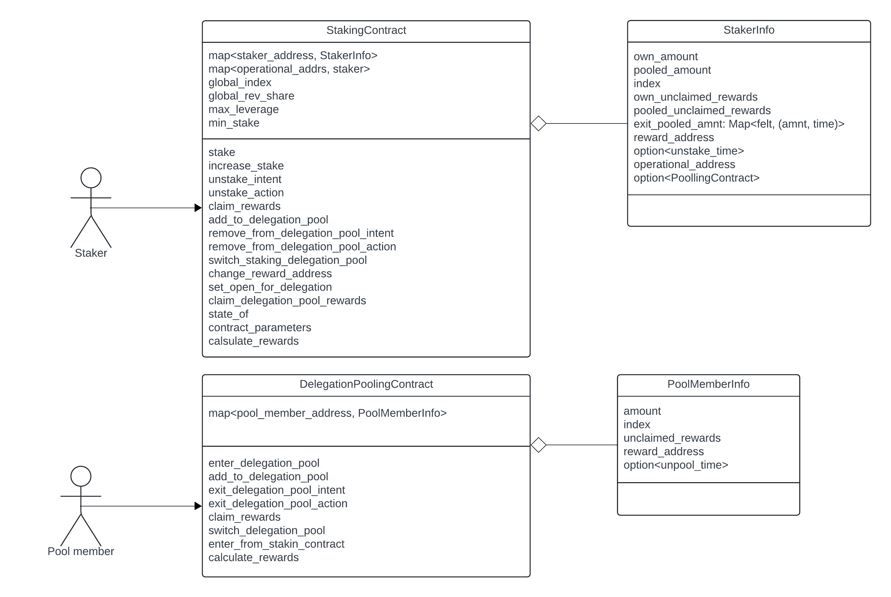

# Staknet Staking <!-- omit from toc -->

## Table of Contents <!-- omit from toc -->
- [About](#about)
  - [Disclaimer](#disclaimer)
  - [Dependencies](#dependencies)
  - [Getting help](#getting-help)
  - [Help make Staking better!](#help-make-staking-better)
  - [Contributing](#contributing)
  - [Security](#security)
- [Contracts block diagram](#contracts-block-diagram)
- [Staking contract](#staking-contract)
  - [Functions](#functions)
    - [stake 💰](#stake-)
    - [increase\_stake 💰](#increase_stake-)
    - [unstake\_intent](#unstake_intent)
    - [unstake\_action 💰](#unstake_action-)
    - [claim\_rewards 💰](#claim_rewards-)
    - [add\_to\_delegation\_pool 💰](#add_to_delegation_pool-)
    - [remove\_from\_delegation\_pool\_intent](#remove_from_delegation_pool_intent)
    - [remove\_from\_delegation\_pool\_action 💰](#remove_from_delegation_pool_action-)
    - [switch\_staking\_delegation\_pool](#switch_staking_delegation_pool)
    - [change\_reward\_address](#change_reward_address)
    - [set\_open\_for\_delegation](#set_open_for_delegation)
    - [claim\_delegation\_pool\_rewards 💰](#claim_delegation_pool_rewards-)
    - [state\_of 👁](#state_of-)
    - [contract\_parameters 👁](#contract_parameters-)
    - [calculate\_rewards](#calculate_rewards)
  - [Events](#events)
    - [Balance Changed](#balance-changed)
    - [New Staking DelegationPool](#new-staking-delegationpool)
    - [Staker Exit intent](#staker-exit-intent)
- [Delegation pooling contract](#delegation-pooling-contract)
  - [Functions](#functions-1)
    - [enter\_delegation\_pool 💰](#enter_delegation_pool-)
    - [add\_to\_delegation\_pool 💰](#add_to_delegation_pool--1)
    - [exit\_delegation\_pool\_intent](#exit_delegation_pool_intent)
    - [exit\_delegaition\_pool\_action 💰](#exit_delegaition_pool_action-)
    - [claim\_rewards 💰](#claim_rewards--1)
    - [switch\_delegation\_pool](#switch_delegation_pool)
    - [enter\_from\_staking\_contract](#enter_from_staking_contract)
    - [calculate\_rewards](#calculate_rewards-1)
  - [Events](#events-1)
    - [New Staking Delegation Pool Member](#new-staking-delegation-pool-member)
    - [Balance Changed](#balance-changed-1)
    - [Delegation Pool Member Exit intent](#delegation-pool-member-exit-intent)

<!--
function info template:
#### description
#### parameters
| name | type |
| ---- | ---- |
#### return 
#### emits
#### errors
#### pre-condition
#### access control
#### logic
-->

# About
This repo holds the implementation of Staknet's staking mechanism.  
Following [Starknet SNIP 18](https://community.starknet.io/t/snip-18-staking-s-first-stage-on-starknet/114334).

## Disclaimer
Staking is a work in progress.

## Dependencies
The project is build with [Turbo repo](https://turbo.build/) and [pnpm](https://pnpm.io/).  
Turbo's installation process will also install the cairo dependencies such as [Scarb](https://docs.swmansion.com/scarb/) and [Starknet foundry](https://foundry-rs.github.io/starknet-foundry/index.html).

## Getting help

Reach out to the maintainer at any of the following:
- [GitHub Discussions](https://github.com/starkware-libs/starknet-staking/discussions)
- Contact options listed on this [GitHub profile](https://github.com/starkware-libs)

## Help make Staking better!

If you want to say thank you or support the active development of Starknet Staking:
- Add a GitHub Star to the project.
- Tweet about Starknet Staking.
- Write interesting articles about the project on [Dev.to](https://dev.to/), [Medium](https://medium.com), or your personal blog.

## Contributing
Thanks for taking the time to contribute! Contributions are what make the open-source community such an amazing place to learn, inspire, and create. Any contributions you make benefit everybody else and are greatly appreciated.

Please read our [contribution guidelines](https://github.com/starkware-libs/starknet-staking/blob/main/docs/CONTRIBUTING.md), and thank you for being involved!

## Security
Starknet Staking follows good practices of security, but 100% security cannot be assured. Starknet Staking is provided "as is" without any warranty. Use at your own risk.

For more information and to report security issues, please refer to our [security documentation](https://github.com/starkware-libs/starknet-staking/blob/main/docs/SECURITY.md).

# Contracts block diagram

# Staking contract
## Functions
### stake 💰
#### description <!-- omit from toc -->
Add a new staker to the stake.
#### parameters <!-- omit from toc -->
| name            | type    |
| --------------- | ------- |
| reward          | address |
| operational     | address |
| amount          | u128    |
| pooling_enabled | boolean |
#### return <!-- omit from toc -->
success: bool
#### emits <!-- omit from toc -->
[Balance Changed](#balance-changed)  
[New Staking Delegation Pool](#new-staking-delegation-pool) - if pooling_enabled
#### errors <!-- omit from toc -->
#### pre-condition <!-- omit from toc -->
1. caller address (staker) is not listed in the contract.
2. Operational address is not listed in the contract.
#### logic  <!-- omit from toc -->
1. Validate amount is above the minimum amount for staking.
2. Transfer amount from staker to be locked in the contract.
3. Create a new registry for the staker (caller).
4. Set:
   1. Staker index = current global index.
   2. unclaimed_amount = 0.
   3. amount = given amount.
5. if pooling_enabled then deploy a pooling contract instance.

// todo: consider if only staker can do this or maybe other addresses as well. 
### increase_stake 💰
#### description <!-- omit from toc -->
Increase the amount staked for an existing staker.
#### parameters <!-- omit from toc -->
| name   | type    |
| ------ | ------- |
| staker | address |
| amount | u128    |
#### return <!-- omit from toc -->
amount: u128 - updated total amount
#### emits <!-- omit from toc -->
[Balance Changed](#balance-changed)
#### errors <!-- omit from toc -->
#### pre-condition <!-- omit from toc -->
1. Staker is listed in the contract.
2. Staker is not in an exit window.
#### access control <!-- omit from toc -->
Only the staker address for which the change is requested for.
#### logic <!-- omit from toc -->
1. Validate amount is above the minimum set threshold.
2. Validate staker is not in an exit window.
3. [Calculate rewards](#calculate_rewards).
4. Increase staked amount.

### unstake_intent
#### description <!-- omit from toc -->
Inform of the intent to exit the stake. 
This will remove the funds from the stake, pausing rewards collection for the staker and it's pool members (if exist).
This will also start the exit window timeout.
#### parameters <!-- omit from toc -->
| name | type |
| ---- | ---- |
|      |      |
#### return <!-- omit from toc -->
unstake_time: time - when will the staker be able to unstake.
#### emits <!-- omit from toc -->
[Staker Exit Intent](#staker-exit-intent)
#### errors <!-- omit from toc -->
#### pre-condition <!-- omit from toc -->
1. Staker (caller) is listed in the contract.
2. Staker (caller) is not in an exit window.
#### access control <!-- omit from toc -->
Only the staker address for which the operation is requested for.
#### logic <!-- omit from toc -->
1. Validate staker is not in an exit window.
2. [Claim delegation pool rewards](#claim_delegation_pool_rewards-) - performs calculate rewards and transfer to pool contract.
3. Set unstake_time.

### unstake_action 💰
#### description <!-- omit from toc -->
Executes the intent to exit the stake if enough time have passed.
Transfers the funds back to the staker.
#### parameters <!-- omit from toc -->
| name   | type    |
| ------ | ------- |
| staker | address |
#### return <!-- omit from toc -->
amount: u128 - amount of tokens transferred back to the staker.
#### emits <!-- omit from toc -->
[Balance Changed](#balance-changed)
#### errors <!-- omit from toc -->
#### pre-condition <!-- omit from toc -->
1. Staker exist and requested to unstake.
2. Enough time have passed from the unstake intent call.
#### access control <!-- omit from toc -->
Any address can execute.
#### logic <!-- omit from toc -->
1. Validate enough time have passed from the unstake intent.
2. claim rewards.
3. remove funds and transfer to staker.
4. delete staker record.

### claim_rewards 💰
#### description <!-- omit from toc -->
Calculate rewards and transfer them to the reward address.
#### parameters <!-- omit from toc -->
| name   | type    |
| ------ | ------- |
| staker | address |
#### return <!-- omit from toc -->
amount: u128 - amount of tokens transferred to the reward address.
#### emits <!-- omit from toc -->
#### errors <!-- omit from toc -->
#### access control <!-- omit from toc -->
Only staking address or reward address can execute.
#### logic <!-- omit from toc -->
1. [Calculate rewards](#calculate_rewards).
2. Transfer unclaimed_rewards
3. Set unclaimed_rewards = 0.

### add_to_delegation_pool 💰
#### description <!-- omit from toc -->
Delegation pooling contract's way to add funds to the staking pool.
#### parameters <!-- omit from toc -->
| name          | type    |
| ------------- | ------- |
| pooled_staker | address |
| amount        | u128    |
#### return <!-- omit from toc -->
pool_amount: u128 - total pool amount after addition.
index: u64 - updated index
#### emits <!-- omit from toc -->
[Balance Changed](#balance-changed)
#### errors <!-- omit from toc -->
#### pre-condition <!-- omit from toc -->
1. Staker is not in an exit window.
2. Staker enabled pooling.
#### access control <!-- omit from toc -->
Only pooling contract for the given staker can execute.
#### logic <!-- omit from toc -->
1. Verify pooled amount after the increase will not exceed leverage limit.
2. [Calculate rewards](#calculate_rewards)
3. transfer funds from pooling contract to staking contract.
4. Add amount to staker's pooled amount

### remove_from_delegation_pool_intent
#### description <!-- omit from toc -->
Inform the staker that an amount will be reduced from the delegation pool.
#### parameters <!-- omit from toc -->
| name       | type            |
| ---------- | --------------- |
| staker     | address         |
| identifier | Span\<felt252\> |
| amount     | u128            |
#### return <!-- omit from toc -->
unstake_time: time - when will the pool member be able to exit.
index: u64 - updated index
#### emits <!-- omit from toc -->
#### errors <!-- omit from toc -->
#### pre-condition <!-- omit from toc -->
1. Staker has a pool.
#### access control <!-- omit from toc -->
Only pooling contract for the given staker can execute.
#### logic <!-- omit from toc -->
1. Validate pooled amount is greater or equal then amount requested to remove.
2. [Calculate rewards](#calculate_rewards).
3. Remove amount from staker's pooled amount.
4. Register intent with given identifier, amount and unstake_time.

### remove_from_delegation_pool_action 💰
#### description <!-- omit from toc -->
Execute the intent to remove funds from pool if enough time have passed.
Transfers the funds to the pooling contract.
#### parameters <!-- omit from toc -->
| name       | type            |
| ---------- | --------------- |
| staker     | address         |
| identifier | Span\<felt252\> |
#### return <!-- omit from toc -->
amount: felt252 - amount being transferred to the pooling contract.
#### emits <!-- omit from toc -->
[Balance Changed](#balance-changed)
#### errors <!-- omit from toc -->
#### pre-condition <!-- omit from toc -->
1. A removal intent request with this identifier have been sent before.
2. Enough time have passed since the intent request.
#### access control <!-- omit from toc -->
Any address can execute.
#### logic <!-- omit from toc -->
1. Validate enough time have passed since remove from pool intent.
2. Transfer funds from staking contract to pooling contract.
3. Remove intent from staker's list.

### switch_staking_delegation_pool
#### description <!-- omit from toc -->
Execute a pool member request to move from one staker's delegation pool to another staker's delegation pool.
#### parameters <!-- omit from toc -->
| name        | type            |
| ----------- | --------------- |
| from_staker | address         |
| to_staker   | address         |
| to_pool     | address         |
| amount      | u128            |
| data        | Span\<felt252\> |
#### return <!-- omit from toc -->
success: bool
#### emits <!-- omit from toc -->
#### errors <!-- omit from toc -->
#### pre-condition <!-- omit from toc -->
1. Enough funds are available in `from_staker` pool.
2. `to_staker` exist in the contract.
3. `to_pool` is the delegation pool contract for `to_staker`.
#### access control <!-- omit from toc -->
Only pooling contract for the given staker can execute.
#### logic <!-- omit from toc -->
1. Remove requested amount from `from_staker`'s pool amount.
2. Add requested amount to `to_staker`'s pool with pool contract address `to_pool`.
3. move amount balance from original pool to new pool's behalf.
4. Call new pool's `enter_from_staking_contract` function.

### change_reward_address
#### description <!-- omit from toc -->
Change the reward address for a staker.
#### parameters <!-- omit from toc -->
| name    | type    |
| ------- | ------- |
| address | address |
#### return <!-- omit from toc -->
success: bool
#### emits <!-- omit from toc -->
#### errors <!-- omit from toc -->
#### pre-condition <!-- omit from toc -->
1. Staker exist in the contract.
#### access control <!-- omit from toc -->
Only staking address.
#### logic <!-- omit from toc -->
1. change registered `reward_address` for the staker.

### set_open_for_delegation
#### description <!-- omit from toc -->
Creates a staking delegation pool for a staker that doesn't have one.
#### parameters <!-- omit from toc -->
| name | type |
| ---- | ---- |
#### return <!-- omit from toc -->
pool: address
#### emits <!-- omit from toc -->
[New Pool](#new-pool)
#### errors <!-- omit from toc -->
#### pre-condition <!-- omit from toc -->
1. Staker exist in the contract.
2. Staker has no pool.
#### access control <!-- omit from toc -->
Only staking address.
#### logic <!-- omit from toc -->
1. generate pooling contract for staker.
2. register pool.

### claim_delegation_pool_rewards 💰
#### description <!-- omit from toc -->
Calculate rewards and transfer the delegation pool rewards to the delegation pool contract.
#### parameters <!-- omit from toc -->
| name   | type    |
| ------ | ------- |
| staker | address |
#### return <!-- omit from toc -->
index: u64 - updated index
#### emits <!-- omit from toc -->
#### errors <!-- omit from toc -->
#### pre-condition <!-- omit from toc -->
1. staker exist in the contract
2. delegation pool exist for the staker.
#### access control <!-- omit from toc -->
Staker or delegation pool contract for this staker.
#### logic <!-- omit from toc -->
1. [Calculate rewards](#calculate_rewards)
2. Transfer rewards to pool contract.

### state_of 👁
#### description <!-- omit from toc -->
return the state of a staker
#### parameters <!-- omit from toc -->
| name   | type    |
| ------ | ------- |
| staker | address |
#### return <!-- omit from toc -->
own_amount
pooled_amount
pooling_contract_address
operational_address
reward_address
staker_unclaimed_rewards
pool_unclaimed_rewards
#### emits <!-- omit from toc -->
#### errors <!-- omit from toc -->
#### pre-condition <!-- omit from toc -->
#### access control <!-- omit from toc -->
#### logic <!-- omit from toc -->

### contract_parameters 👁
#### description <!-- omit from toc -->
Return general parameters of the contract.
#### parameters <!-- omit from toc -->
| name | type |
| ---- | ---- |
#### return <!-- omit from toc -->
leverage_limit
minimum_stake
#### emits <!-- omit from toc -->
#### errors <!-- omit from toc -->
#### pre-condition <!-- omit from toc -->
#### access control <!-- omit from toc -->
#### logic <!-- omit from toc -->

### calculate_rewards
>**note:** internal logic
#### description <!-- omit from toc -->
Calculate rewards, add amount to unclaimed_rewards, update index.
#### parameters <!-- omit from toc -->
| name   | type    |
| ------ | ------- |
| staker | address |
#### return <!-- omit from toc -->
success: bool
#### emits <!-- omit from toc -->
#### errors <!-- omit from toc -->
#### pre-condition <!-- omit from toc -->
#### access control <!-- omit from toc -->
internal function.
#### logic <!-- omit from toc -->
1. Calculate rewards for `own_amount`.
2. Calculate rewards for `pooled_amount`.
3. Update `own_unclaimed_rewards` with own rewards + pooled rewards rev share.
4. Update `pooled_unclaimed_rewards` with pooled rewards without rev share. 
5. Update index.

## Events
### Balance Changed
| data   | type    | keyed |
| ------ | ------- | ----- |
| staker | address | ✅     |
| amount | u128    | ❌     |

### New Staking DelegationPool
| data     | type    | keyed |
| -------- | ------- | ----- |
| staker   | address | ✅     |
| contract | address | ✅     |

### Staker Exit intent
| data    | type    | keyed |
| ------- | ------- | ----- |
| staker  | address | ✅     |
| exit_at | time    | ❌     |

# Delegation pooling contract

## Functions
### enter_delegation_pool 💰
#### description <!-- omit from toc -->
Add a new pool member to the delegation pool.
#### parameters <!-- omit from toc -->
| name   | type    |
| ------ | ------- |
| reward | address |
| amount | u128    |
#### return <!-- omit from toc -->
success: bool
#### emits <!-- omit from toc -->
[Pool - Balance Changed](#balance-changed-1)
[Stake - Balance Changed](#balance-changed)
#### errors <!-- omit from toc -->
#### pre-condition <!-- omit from toc -->
1. caller address (pool member) is not listed in the contract.
#### logic <!-- omit from toc -->
1. Check that staker for this pool instance is not in exit window.
2. Verify leverage after this amount addition is valid.
3. Transfer funds from caller to the contract.
4. Call staking contract's [add_to_delegation_pool](#add_to_delegation_pool-).
5. Get current index from staking contract.
6. Create entry for pool member.

### add_to_delegation_pool 💰
#### description <!-- omit from toc -->
Increase the funds for an existing pool member.
#### parameters <!-- omit from toc -->
| name   | type |
| ------ | ---- |
| amount | u128 |
#### return <!-- omit from toc -->
amount: u128 - updated total amount for the caller.
#### emits <!-- omit from toc -->
[Pool - Balance Changed](#balance-changed-1)
[Stake - Balance Changed](#balance-changed)
#### errors <!-- omit from toc -->
#### pre-condition <!-- omit from toc -->
1. caller is a pool member listed in the contract.
#### access control <!-- omit from toc -->
only a listed pool member address.
#### logic <!-- omit from toc -->
1. Check that staker for this pool instance is not in exit window.
2. Verify leverage after this amount addition is valid.
3. [Calculate rewards](#calculate_rewards-1)
4. Transfer funds from caller to the contract.
5. Call staking contract's [add_to_delegation_pool](#add_to_delegation_pool-).
6. Get current index from staking contract.
7. Update pool memeber entry with
   1. index
   2. amount
   3. unclaimed rewards

### exit_delegation_pool_intent
#### description <!-- omit from toc -->
Inform of the intent to exit the stake. This will remove the funds from the stake, pausing rewards collection for the pool member. This will also start the exit window timeout.
#### parameters <!-- omit from toc -->
| name | type |
| ---- | ---- |
#### return <!-- omit from toc -->
#### emits <!-- omit from toc -->
[Delegation Pool Member Exit Intent](#delegation-pool-member-exit-intent)
#### errors <!-- omit from toc -->
#### pre-condition <!-- omit from toc -->
1. Pool member (caller) is listed in the contract.
2. Pool member (caller) is not in an exit window.
#### access control <!-- omit from toc -->
Only the pool member address for which the operation is requested for.
#### logic <!-- omit from toc -->
1. Validate pool member is not in exit window.
2. [Calculate rewards](#calculate_rewards-1)
3. If staker is in exit window set it's unstake time as the pool member exit_pool_time.
4. Else set exit_pool_time to the configured value.
5. [Inform staking contract](#remove_from_delegation_pool_intent)

### exit_delegaition_pool_action 💰
#### description <!-- omit from toc -->
Executes the intent to exit the stake if enough time have passed. Transfers the funds back to the pool member.
#### parameters <!-- omit from toc -->
| name        | type    |
| ----------- | ------- |
| pool_member | address |
#### return <!-- omit from toc -->
amount: u128 - amount of tokens transferred back to the pool member.
#### emits <!-- omit from toc -->
[Pool - Balance Changed](#balance-changed-1)
[Stake - Balance Changed](#balance-changed)
#### errors <!-- omit from toc -->
#### pre-condition <!-- omit from toc -->
1. Pool member exist and requested to unstake.
2. Enough time have passed from the delegation pool exit intent call.
#### access control <!-- omit from toc -->
Any address can execute.
#### logic <!-- omit from toc -->
1. Validate enough time have passed from the exit intent.
2. [claim rewards](#claim_rewards--1).
3. [Remove from delegation pool action](#remove_from_delegation_pool_action-).
4. Transfer funds to pool member.

### claim_rewards 💰
#### description <!-- omit from toc -->
Calculate rewards and transfer them to the reward address.
#### parameters <!-- omit from toc -->
| name        | type    |
| ----------- | ------- |
| pool_member | address |
#### return <!-- omit from toc -->
amount: u128 - amount of tokens transferred to the reward address.
#### emits <!-- omit from toc -->
#### errors <!-- omit from toc -->
#### pre-condition <!-- omit from toc -->
#### access control <!-- omit from toc -->
Only pool member address or reward address can execute.
#### logic <!-- omit from toc -->
1. [Calculate rewards](#calculate_rewards-1).
2. Transfer unclaimed_rewards
3. Set unclaimed_rewards = 0.

### switch_delegation_pool
#### description <!-- omit from toc -->
Request the staking contract to move a pool member to another pool contract.
#### parameters <!-- omit from toc -->
| name      | type    |
| --------- | ------- |
| to_staker | address |
| to_pool   | address |
| amount    | u128    |
#### return <!-- omit from toc -->
amount: u128 - amount left in exit window for the pool member in this pool.
#### emits <!-- omit from toc -->
[Pool - Balance Changed](#balance-changed-1)
#### errors <!-- omit from toc -->
#### pre-condition <!-- omit from toc -->
1. pool member (caller) is in exit window.
2. pool member's amount is greater or equal to the amount requested.
#### access control <!-- omit from toc -->
Only pool member can call.
#### logic <!-- omit from toc -->
1. Compose and serialize data: pool member address and reward address.
2. Call staking contract's [switch delegation pool](#switch_staking_delegation_pool).

### enter_from_staking_contract
#### description <!-- omit from toc -->
Entry point for staking contract to inform pool of a pool member being moved from another pool to this one.
No funds need to be transferred since staking contract holds the pool funds.
#### parameters <!-- omit from toc -->
| name   | type          |
| ------ | ------------- |
| amount | u128          |
| index  | u64           |
| data   | Span<felt252> |
#### return <!-- omit from toc -->
success: bool
#### emits <!-- omit from toc -->
[Pool - Balance Changed](#balance-changed-1)
#### errors <!-- omit from toc -->
#### pre-condition <!-- omit from toc -->
#### access control <!-- omit from toc -->
Only staking contract can call.
#### logic <!-- omit from toc -->
1. Check that staker for this pool instance is not in exit window.
2. Verify leverage after this amount addition is valid.
3. Deserialize data, get pool_member and rewrad addresses.
4. If pool member is listed in the contract:
   1. [Calculate rewards](#calculate_rewards-1)
   2. Update pool member entry
5. Else
   1. Create an entry for the pool member.

### calculate_rewards
>**note:** internal logic
#### description <!-- omit from toc -->
Calculate rewards, add amount to unclaimed_rewards, update index.
Assumes this function call is after an one of the interactions with the staking contract:
1. [add to delegation pool](#add_to_delegation_pool-)
2. [claim delegation pool rewards](#claim_delegation_pool_rewards-)
3. [exit delegation pool intent](#exit_delegation_pool_intent)
that perform rewards calculation and index update on the staker and returns the updated index.
#### parameters <!-- omit from toc -->
| name  | type |
| ----- | ---- |
| index | u64  |
#### return <!-- omit from toc -->
success: bool
#### emits <!-- omit from toc -->
#### errors <!-- omit from toc -->
#### pre-condition <!-- omit from toc -->
#### access control <!-- omit from toc -->
internal function.
#### logic <!-- omit from toc -->
1. Calculate rewards for pool member (caller).
2. Update `unclaimed_rewards`.
3. Update index.

## Events
### New Staking Delegation Pool Member
| data        | type    | keyed |
| ----------- | ------- | ----- |
| staker      | address |       |
| pool_member | address |       |
| amount      | u128    |       |

### Balance Changed
| data        | type    | keyed |
| ----------- | ------- | ----- |
| pool_member | address | ✅     |
| amount      | u128    | ❌     |

### Delegation Pool Member Exit intent
| data        | type    | keyed |
| ----------- | ------- | ----- |
| pool_member | address | ✅     |
| exit_at     | time    | ❌     |