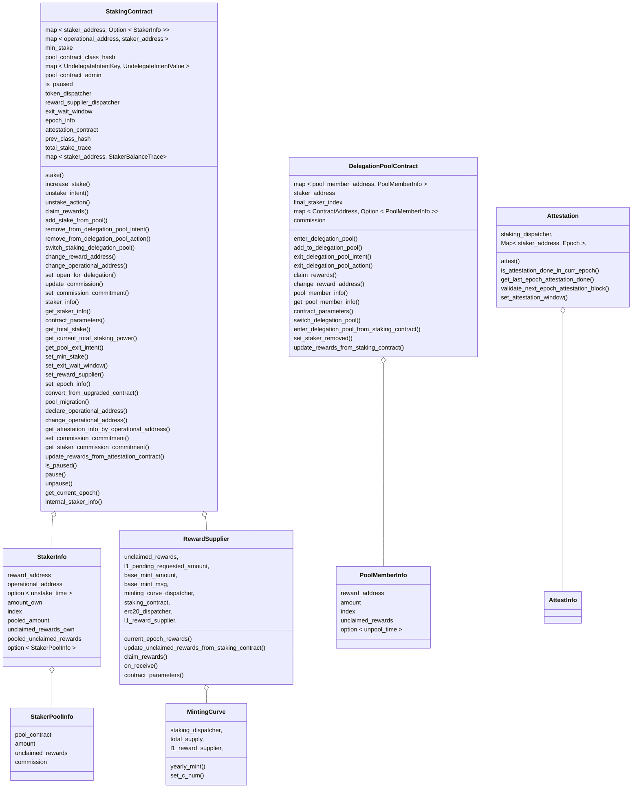
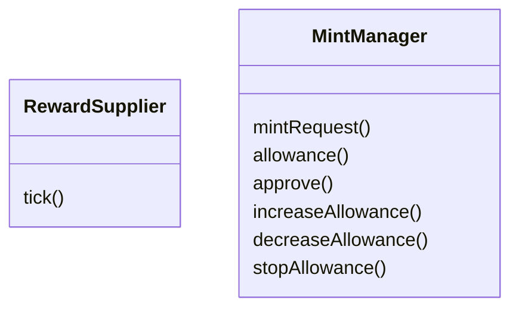
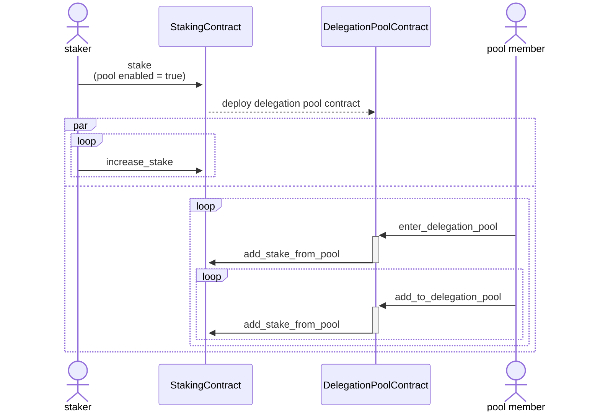
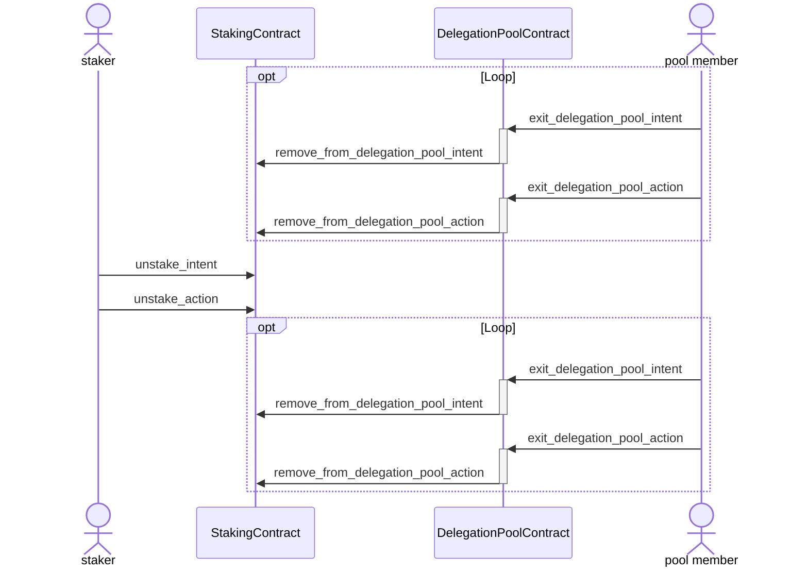
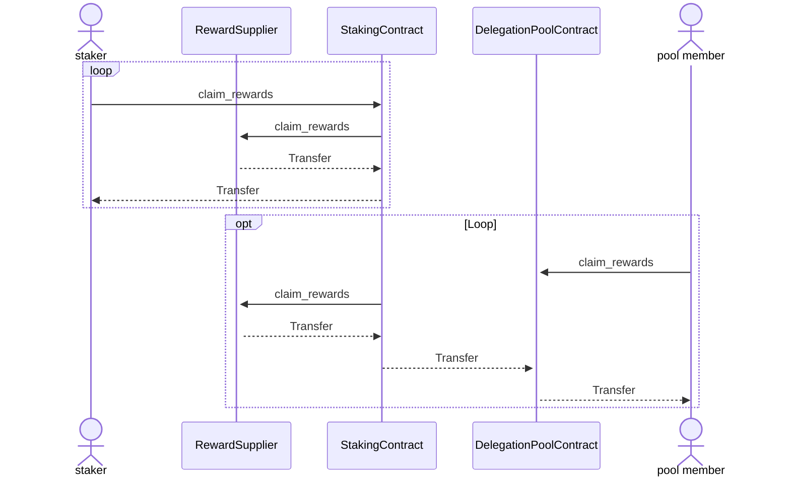
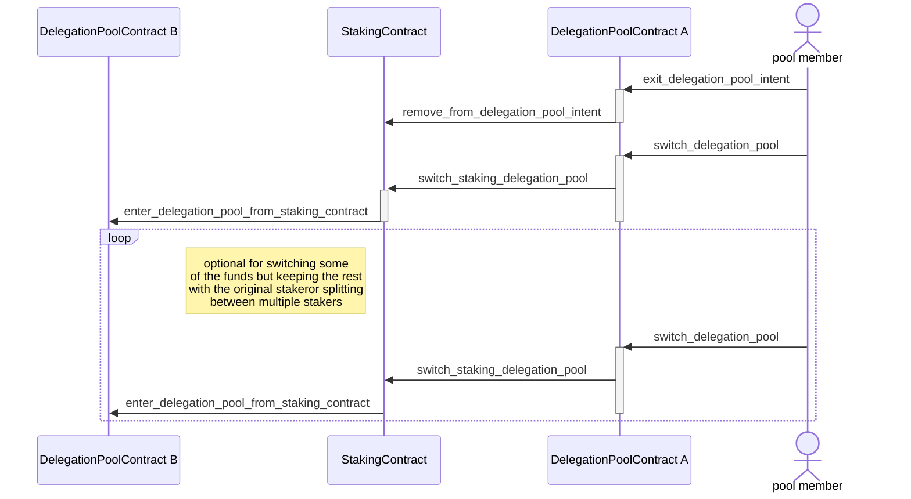
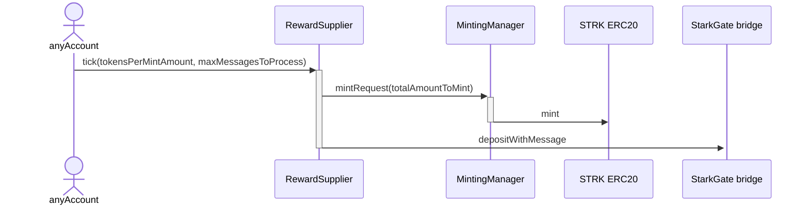

# Spec <!-- omit from toc -->
<details>
    <summary><strong style="font-size: 1.5em;">Table of contents</strong></summary>

- [Diagrams](#diagrams)
  - [L2 Contracts block diagram](#l2-contracts-block-diagram)
  - [L1 Contracts block diagram](#l1-contracts-block-diagram)
  - [Enter protocol flow diagram](#enter-protocol-flow-diagram)
  - [Exit protocol flow diagram](#exit-protocol-flow-diagram)
  - [Rewards claim flow diagram](#rewards-claim-flow-diagram)
  - [Delegation pool switching flow diagram](#delegation-pool-switching-flow-diagram)
  - [L1 Mint \& transfer flow diagram](#l1-mint--transfer-flow-diagram)
  - [L2 Rewards calculation and minting request flow diagram](#l2-rewards-calculation-and-minting-request-flow-diagram)
- [Staking contract](#staking-contract)
  - [Functions](#functions)
    - [stake](#stake)
    - [increase\_stake](#increase_stake)
    - [unstake\_intent](#unstake_intent)
    - [unstake\_action](#unstake_action)
    - [claim\_rewards](#claim_rewards)
    - [add\_stake\_from\_pool](#add_stake_from_pool)
    - [remove\_from\_delegation\_pool\_intent](#remove_from_delegation_pool_intent)
    - [remove\_from\_delegation\_pool\_action](#remove_from_delegation_pool_action)
    - [switch\_staking\_delegation\_pool](#switch_staking_delegation_pool)
    - [change\_reward\_address](#change_reward_address)
    - [set\_open\_for\_delegation](#set_open_for_delegation)
    - [update\_commission](#update_commission)
    - [set\_commission\_commitment](#set_commission_commitment)
    - [get\_staker\_commission\_commitment](#get_staker_commission_commitment)
    - [staker\_info](#staker_info)
    - [get\_staker\_info](#get_staker_info)
    - [get\_current\_epoch](#get_current_epoch)
    - [get\_epoch\_info](#get_epoch_info)
    - [update\_rewards\_from\_attestation\_contract](#update_rewards_from_attestation_contract)
    - [fn get\_attestation\_info\_by\_operational\_address](#fn-get_attestation_info_by_operational_address)
    - [contract\_parameters](#contract_parameters)
    - [get\_total\_stake](#get_total_stake)
    - [get\_current\_total\_staking\_power](#get_current_total_staking_power)
    - [get\_pool\_exit\_intent](#get_pool_exit_intent)
    - [declare\_operational\_address](#declare_operational_address)
    - [change\_operational\_address](#change_operational_address)
    - [pool\_migration](#pool_migration)
    - [is\_paused](#is_paused)
    - [internal\_staker\_info](#internal_staker_info)
    - [pause](#pause)
    - [unpause](#unpause)
    - [set\_min\_stake](#set_min_stake)
    - [set\_exit\_wait\_window](#set_exit_wait_window)
    - [set\_reward\_supplier](#set_reward_supplier)
    - [set\_epoch\_info](#set_epoch_info)
    - [convert\_from\_upgraded\_contract](#convert_from_upgraded_contract)
  - [Events](#events)
    - [Stake Balance Changed](#stake-balance-changed)
    - [New Delegation Pool](#new-delegation-pool)
    - [New Staker](#new-staker)
    - [Staker Exit intent](#staker-exit-intent)
    - [Rewards Supplied To Delegation Pool](#rewards-supplied-to-delegation-pool)
    - [Commission Changed](#commission-changed)
    - [Change Delegation Pool Intent](#change-delegation-pool-intent)
    - [Delete Staker](#delete-staker)
    - [Staker Reward Claimed](#staker-reward-claimed)
    - [Staker Reward Address Changed](#staker-reward-address-changed)
    - [Operational Address Declared](#operational-address-declared)
    - [Operational Address Changed](#operational-address-changed)
    - [Remove From Delegation Pool Intent](#remove-from-delegation-pool-intent)
    - [Remove From Delegation Pool Action](#remove-from-delegation-pool-action)
    - [Paused](#paused)
    - [Unpaused](#unpaused)
    - [Minimum Stake Changed](#minimum-stake-changed)
    - [Exit Wait Window Changed](#exit-wait-window-changed)
    - [Reward Supplier Changed](#reward-supplier-changed)
    - [Epoch Info Changed](#epoch-info-changed)
    - [Staker Rewards Updated](#staker-rewards-updated)
    - [Commission Commitment Set](#commission-commitment-set)
  - [Functions](#functions-1)
    - [enter\_delegation\_pool](#enter_delegation_pool)
    - [add\_to\_delegation\_pool](#add_to_delegation_pool)
    - [exit\_delegation\_pool\_intent](#exit_delegation_pool_intent)
    - [exit\_delegation\_pool\_action](#exit_delegation_pool_action)
    - [claim\_rewards](#claim_rewards-1)
    - [switch\_delegation\_pool](#switch_delegation_pool)
    - [enter\_delegation\_pool\_from\_staking\_contract](#enter_delegation_pool_from_staking_contract)
    - [set\_staker\_removed](#set_staker_removed)
    - [change\_reward\_address](#change_reward_address-1)
    - [pool\_member\_info](#pool_member_info)
    - [get\_pool\_member\_info](#get_pool_member_info)
    - [contract\_parameters](#contract_parameters-1)
    - [update\_rewards\_from\_staking\_contract](#update_rewards_from_staking_contract)
  - [Events](#events-1)
    - [Pool Member Balance Changed](#pool-member-balance-changed)
    - [Pool Member Exit Intent](#pool-member-exit-intent)
    - [Pool Member Exit Action](#pool-member-exit-action)
    - [Staker Removed](#staker-removed)
    - [New Pool Member](#new-pool-member)
    - [Delete Pool Member](#delete-pool-member)
    - [Pool Member Reward Claimed](#pool-member-reward-claimed)
    - [Pool Member Reward Address Changed](#pool-member-reward-address-changed)
    - [Switch Delegation Pool](#switch-delegation-pool)
- [L2 Reward supplier contract](#l2-reward-supplier-contract)
  - [Functions](#functions-2)
    - [current\_epoch\_rewards](#current_epoch_rewards)
    - [update\_unclaimed\_rewards\_from\_staking\_contract](#update_unclaimed_rewards_from_staking_contract)
    - [claim\_rewards](#claim_rewards-2)
    - [contract\_parameters](#contract_parameters-2)
    - [on\_receive](#on_receive)
  - [Events](#events-2)
    - [Mint Request](#mint-request)
- [Minting Curve Contract](#minting-curve-contract)
  - [Functions](#functions-3)
    - [yearly\_mint](#yearly_mint)
    - [contract\_parameters](#contract_parameters-3)
    - [set\_c\_num](#set_c_num)
  - [Events](#events-3)
    - [Total Supply Changed](#total-supply-changed)
    - [Minting Cap Changed](#minting-cap-changed)
- [Attestation Contract](#attestation-contract)
  - [Functions](#functions-4)
    - [attest](#attest)
    - [is\_attestation\_done\_in\_curr\_epoch](#is_attestation_done_in_curr_epoch)
    - [get\_last\_epoch\_attestation\_done](#get_last_epoch_attestation_done)
    - [validate\_next\_epoch\_attestation\_block](#validate_next_epoch_attestation_block)
    - [attestation\_window](#attestation_window)
    - [set\_attestation\_window](#set_attestation_window)
  - [Events](#events-4)
    - [Staker Attestation Successful](#staker-attestation-successful)
    - [Attestation Window Changed](#attestation-window-changed)
- [Errors](#errors)
    - [STAKER\_EXISTS](#staker_exists)
    - [STAKER\_NOT\_EXISTS](#staker_not_exists)
    - [OPERATIONAL\_EXISTS](#operational_exists)
    - [AMOUNT\_LESS\_THAN\_MIN\_STAKE](#amount_less_than_min_stake)
    - [COMMISSION\_OUT\_OF\_RANGE](#commission_out_of_range)
    - [CONTRACT\_IS\_PAUSED](#contract_is_paused)
    - [UNSTAKE\_IN\_PROGRESS](#unstake_in_progress)
    - [CALLER\_CANNOT\_INCREASE\_STAKE](#caller_cannot_increase_stake)
    - [MISSING\_UNSTAKE\_INTENT](#missing_unstake_intent)
    - [INTENT\_WINDOW\_NOT\_FINISHED](#intent_window_not_finished)
    - [UNEXPECTED\_BALANCE](#unexpected_balance)
    - [STAKER\_ALREADY\_REMOVED](#staker_already_removed)
    - [CLAIM\_REWARDS\_FROM\_UNAUTHORIZED\_ADDRESS](#claim_rewards_from_unauthorized_address)
    - [CALLER\_IS\_NOT\_POOL\_CONTRACT](#caller_is_not_pool_contract)
    - [MISSING\_POOL\_CONTRACT](#missing_pool_contract)
    - [AMOUNT\_TOO\_HIGH](#amount_too_high)
    - [MISSMATCHED\_DELEGATION\_POOL](#missmatched_delegation_pool)
    - [MISSING\_UNDELEGATE\_INTENT](#missing_undelegate_intent)
    - [STAKER\_ALREADY\_HAS\_POOL](#staker_already_has_pool)
    - [STAKER\_INACTIVE](#staker_inactive)
    - [POOL\_MEMBER\_EXISTS](#pool_member_exists)
    - [AMOUNT\_IS\_ZERO](#amount_is_zero)
    - [POOL\_MEMBER\_DOES\_NOT\_EXIST](#pool_member_does_not_exist)
    - [UNDELEGATE\_IN\_PROGRESS](#undelegate_in_progress)
    - [CALLER\_CANNOT\_ADD\_TO\_POOL](#caller_cannot_add_to_pool)
    - [POOL\_CLAIM\_REWARDS\_FROM\_UNAUTHORIZED\_ADDRESS](#pool_claim_rewards_from_unauthorized_address)
    - [CALLER\_IS\_NOT\_STAKING\_CONTRACT](#caller_is_not_staking_contract)
    - [CALLER\_IS\_NOT\_ATTESTATION\_CONTRACT](#caller_is_not_attestation_contract)
    - [SWITCH\_POOL\_DATA\_DESERIALIZATION\_FAILED](#switch_pool_data_deserialization_failed)
    - [ONLY\_SECURITY\_AGENT](#only_security_agent)
    - [ONLY\_SECURITY\_ADMIN](#only_security_admin)
    - [ONLY\_TOKEN\_ADMIN](#only_token_admin)
    - [INVALID\_UNDELEGATE\_INTENT\_VALUE](#invalid_undelegate_intent_value)
    - [OPERATIONAL\_NOT\_ELIGIBLE](#operational_not_eligible)
    - [OPERATIONAL\_IN\_USE](#operational_in_use)
    - [INVALID\_EPOCH\_LENGTH](#invalid_epoch_length)
    - [INVALID\_BLOCK\_DURATION](#invalid_block_duration)
    - [INVALID\_COMMISSION](#invalid_commission)
    - [INVALID\_COMMISSION\_WITH\_COMMITMENT](#invalid_commission_with_commitment)
    - [COMMISSION\_COMMITMENT\_EXISTS](#commission_commitment_exists)
    - [MAX\_COMMISSION\_TOO\_LOW](#max_commission_too_low)
    - [EXPIRATION\_EPOCH\_TOO\_EARLY](#expiration_epoch_too_early)
    - [EXPIRATION\_EPOCH\_TOO\_FAR](#expiration_epoch_too_far)
    - [ATTEST\_WINDOW\_TOO\_SMALL](#attest_window_too_small)
    - [ATTEST\_EPOCH\_ZERO](#attest_epoch_zero)
    - [ATTEST\_WRONG\_BLOCK\_HASH](#attest_wrong_block_hash)
    - [COMMISSION\_COMMITMENT\_EXPIRED](#commission_commitment_expired)
    - [COMMISSION\_COMMITMENT\_NOT\_SET](#commission_commitment_not_set)
    - [CALLER\_IS\_ZERO\_ADDRESS](#caller_is_zero_address)
    - [UNAUTHORIZED\_MESSAGE\_SENDER](#unauthorized_message_sender)
    - [TOTAL\_SUPPLY\_NOT\_AMOUNT\_TYPE](#total_supply_not_amount_type)
    - [C\_NUM\_OUT\_OF\_RANGE](#c_num_out_of_range)
    - [EPOCH\_INFO\_ALREADY\_UPDATED](#epoch_info_already_updated)
    - [EPOCH\_INFO\_UPDATED\_IN\_FIRST\_EPOCH](#epoch_info_updated_in_first_epoch)
    - [ON\_RECEIVE\_NOT\_FROM\_STARKGATE](#on_receive_not_from_starkgate)
    - [UNEXPECTED\_TOKEN](#unexpected_token)
    - [SELF\_SWITCH\_NOT\_ALLOWED](#self_switch_not_allowed)
    - [INSUFFICIENT\_ALLOWANCE](#insufficient_allowance)
    - [INSUFFICIENT\_BALANCE](#insufficient_balance)
    - [REWARD\_ADDRESS\_MISMATCH](#reward_address_mismatch)
    - [INVALID\_ENTRY\_TO\_CLAIM\_FROM](#invalid_entry_to_claim_from)
    - [INSUFFICIENT\_POOL\_BALANCE](#insufficient_pool_balance)
- [Structs](#structs)
    - [StakerPoolInfo](#stakerpoolinfo)
    - [StakerInfo](#stakerinfo)
    - [StakingContractInfo](#stakingcontractinfo)
    - [PoolMemberInfo](#poolmemberinfo)
    - [PoolContractInfo](#poolcontractinfo)
    - [RewardSupplierInfo](#rewardsupplierinfo)
    - [UndelegateIntentKey](#undelegateintentkey)
    - [UndelegateIntentValue](#undelegateintentvalue)
    - [TimeStamp](#timestamp)
    - [TimeDelta](#timedelta)
    - [AttestationInfo](#attestationinfo)
    - [EpochInfo](#epochinfo)
    - [MintingCurveContractInfo](#mintingcurvecontractinfo)
- [Type aliases](#type-aliases)
    - [Amount](#amount)
    - [Commission](#commission)
    - [Index](#index)
    - [Inflation](#inflation)
    - [Epoch](#epoch)

</details>

<!--
function info template:
#### description
#### parameters
| name | type |
| ---- | ---- |
#### return 
#### emits
#### errors
#### pre-condition
#### access control
#### logic
-->
# Diagrams
## L2 Contracts block diagram


## L1 Contracts block diagram


## Enter protocol flow diagram


## Exit protocol flow diagram


## Rewards claim flow diagram


## Delegation pool switching flow diagram


## L1 Mint & transfer flow diagram


## L2 Rewards calculation and minting request flow diagram
```mermaid
sequenceDiagram
  actor caller
  participant Staking
  participant RewardSupplier
  participant MintingCurve
  participant L1
  caller ->>+ Staking: update_global_index
  RewardSupplier ->>+ MintingCurve: yearly_mint
  MintingCurve ->> Staking: get_total_stake
  MintingCurve -->>- RewardSupplier: return yearly amount
  RewardSupplier ->>- L1: send mint request
  deactivate Staking
```


# Staking contract
## Functions
### stake
```rust
fn stake(
  ref self: TContractState,
  reward_address: ContractAddress,
  operational_address: ContractAddress,
  amount: Amount,
  pool_enabled: bool,
  commission: Commission
)
```
#### description <!-- omit from toc -->
Add a new staker to the stake.
#### emits <!-- omit from toc -->
1. [New Delegation Pool](#new-delegation-pool) - if `pool_enabled` is true
2. [New Staker](#new-staker)
3. [Stake Balance Changed](#stake-balance-changed)
#### errors <!-- omit from toc -->
1. [CONTRACT\_IS\_PAUSED](#contract_is_paused)
2. [STAKER\_EXISTS](#staker_exists)
3. [OPERATIONAL\_EXISTS](#operational_exists)
4. [AMOUNT\_LESS\_THAN\_MIN\_STAKE](#amount_less_than_min_stake)
5. [COMMISSION\_OUT\_OF\_RANGE](#commission_out_of_range)
#### pre-condition <!-- omit from toc -->
1. Staking contract is unpaused.
2. Staker (caller) is not listed in the contract.
3. `operational_address` is not listed in the contract.
4. `amount` is above the minimum amount for staking.
5. `commission` is not above the maximum commission for staking.
#### access control <!-- omit from toc -->
Only staker address.
#### logic  <!-- omit from toc -->
1. Transfer amount from staker to be locked in the contract.
2. Create a new registry for the staker (caller).
3. Set:
   1. Staker index = current global index.
   2. Unclaimed amount = 0.
   3. amount = given amount.
4. If pool enabled then deploy a pool contract instance.

### increase_stake
```rust
fn increase_stake(
    ref self: ContractState, 
    staker_address: ContractAddress, 
    amount: Amount
) -> Amount
``` 
#### description <!-- omit from toc -->
Increase the amount staked for an existing staker.
Return the updated total amount.
#### emits <!-- omit from toc -->
[Stake Balance Changed](#stake-balance-changed)
#### errors <!-- omit from toc -->
1. [CONTRACT\_IS\_PAUSED](#contract_is_paused)
2. [STAKER\_NOT\_EXISTS](#staker_not_exists)
3. [UNSTAKE\_IN\_PROGRESS](#unstake_in_progress)
4. [CALLER\_CANNOT\_INCREASE\_STAKE](#caller_cannot_increase_stake)
5. [AMOUNT\_IS\_ZERO](#amount_is_zero)
#### pre-condition <!-- omit from toc -->
1. Staking contract is unpaused.
2. Staker is listed in the contract.
3. Staker is not in an exit window.
4. `amount` is not zero.
#### access control <!-- omit from toc -->
Only the staker address or rewards address for which the change is requested for.
#### logic <!-- omit from toc -->
1. Increase staked amount.

### unstake_intent
```rust
fn unstake_intent(ref self: ContractState) -> TimeStamp
```
#### description <!-- omit from toc -->
Inform of the intent to exit the stake. 
This will remove the funds from the stake, and block the staker's ability to attest starting from the current epoch.
This will also start the exit window timeout.
Return the time in which the staker will be able to unstake.
#### emits <!-- omit from toc -->
1. [Staker Exit Intent](#staker-exit-intent)
2. [Stake Balance Changed](#stake-balance-changed)
#### errors <!-- omit from toc -->
1. [CONTRACT\_IS\_PAUSED](#contract_is_paused)
2. [STAKER\_NOT\_EXISTS](#staker_not_exists)
3. [UNSTAKE\_IN\_PROGRESS](#unstake_in_progress)
#### pre-condition <!-- omit from toc -->
1. Staking contract is unpaused.
2. Staker (caller) is listed in the contract.
3. Staker (caller) is not in an exit window.
#### access control <!-- omit from toc -->
Only the staker address for which the operation is requested for.
#### logic <!-- omit from toc -->
1. Set unstake time.

### unstake_action
```rust
fn unstake_action(
  ref self: ContractState, 
  staker_address: ContractAddress
) -> Amount
```
#### description <!-- omit from toc -->
Executes the intent to exit the stake if enough time have passed.
Transfers the funds back to the staker.
Return the amount of tokens transferred back to the staker.
#### emits <!-- omit from toc -->
1. [Staker Reward Claimed](#staker-reward-claimed)
2. If pool exists: [Rewards Supplied To Delegation Pool](#rewards-supplied-to-delegation-pool)
3. If pool exists: [Staker Removed](#staker-removed)
4. [Delete Staker](#delete-staker)
#### errors <!-- omit from toc -->
1. [CONTRACT\_IS\_PAUSED](#contract_is_paused)
2. [STAKER\_NOT\_EXISTS](#staker_not_exists)
3. [MISSING\_UNSTAKE\_INTENT](#missing_unstake_intent)
4. [INTENT\_WINDOW\_NOT\_FINISHED](#intent_window_not_finished)
5. [UNEXPECTED\_BALANCE](#unexpected_balance)
6. [STAKER\_ALREADY\_REMOVED](#staker_already_removed)
#### pre-condition <!-- omit from toc -->
1. Staking contract is unpaused.
2. Staker exist and requested to unstake.
3. Enough time have passed from the unstake intent call.
#### access control <!-- omit from toc -->
Any address can execute.
#### logic <!-- omit from toc -->
1. Claim rewards.
2. Remove funds and transfer to staker.
3. Transfer pool unclaimed rewards and stake to delegation pool contract.
4. Call [set\_staker\_removed](#set_staker_removed) on the delegation_pool_contract.
5. Delete staker record.

### claim_rewards
```rust
fn claim_rewards(
  ref self: ContractState, 
  staker_address: ContractAddress
) -> Amount
```
#### description <!-- omit from toc -->
Transfer unclaimed rewards of the given staker to its reward address.
Return the amount of tokens transferred to the reward address.
#### emits <!-- omit from toc -->
1. [Staker Reward Claimed](#staker-reward-claimed)
#### errors <!-- omit from toc -->
1. [CONTRACT\_IS\_PAUSED](#contract_is_paused)
2. [STAKER\_NOT\_EXISTS](#staker_not_exists)
3. [CLAIM\_REWARDS\_FROM\_UNAUTHORIZED\_ADDRESS](#claim_rewards_from_unauthorized_address)
#### pre-condition <!-- omit from toc -->
1. Staking contract is unpaused.
2. Staker is listed in the contract.
#### access control <!-- omit from toc -->
Only staker address or reward address can execute.
#### logic <!-- omit from toc -->
1. Transfer unclaimed_rewards.
2. Set unclaimed_rewards = 0.

### add_stake_from_pool
```rust
fn add_stake_from_pool(
    ref self: ContractState, 
    staker_address: ContractAddress, 
    amount: Amount
)
```
#### description <!-- omit from toc -->
Delegation pool contract's way to add funds to the staking pool.
#### return <!-- omit from toc -->
#### emits <!-- omit from toc -->
1. [Stake Balance Changed](#stake-balance-changed)
#### errors <!-- omit from toc -->
1. [CONTRACT\_IS\_PAUSED](#contract_is_paused)
2. [STAKER\_NOT\_EXISTS](#staker_not_exists)
3. [UNSTAKE\_IN\_PROGRESS](#unstake_in_progress)
4. [MISSING\_POOL\_CONTRACT](#missing_pool_contract)
5. [CALLER\_IS\_NOT\_POOL\_CONTRACT](#caller_is_not_pool_contract)
#### pre-condition <!-- omit from toc -->
1. Staking contract is unpaused.
2. Staker is listed in the contract.
3. Staker is not in an exit window.
4. Staker has pool contract.
5. Caller is pool contract.
#### access control <!-- omit from toc -->
Only pool contract for the given staker can execute.
#### logic <!-- omit from toc -->
1. transfer funds from pool contract to staking contract.
2. Add amount to staker's pooled amount

### remove_from_delegation_pool_intent
```rust
fn remove_from_delegation_pool_intent(
    ref self: ContractState,
    staker_address: ContractAddress,
    identifier: felt252,
    amount: Amount,
) -> TimeStamp
```
#### description <!-- omit from toc -->
Inform the staker that an amount will be reduced from the delegation pool.
Return the time in which the pool member will be able to exit.
#### emits <!-- omit from toc -->
1. [Remove From Delegation Pool Intent](#remove-from-delegation-pool-intent)
2. [Stake Balance Changed](#stake-balance-changed)
#### errors <!-- omit from toc -->
1. [CONTRACT\_IS\_PAUSED](#contract_is_paused)
2. [INVALID\_UNDELEGATE\_INTENT\_VALUE](#invalid_undelegate_intent_value)
3. [STAKER\_NOT\_EXISTS](#staker_not_exists)
4. [MISSING\_POOL\_CONTRACT](#missing_pool_contract)
5. [CALLER\_IS\_NOT\_POOL\_CONTRACT](#caller_is_not_pool_contract)
6. [AMOUNT\_TOO\_HIGH](#amount_too_high)
#### pre-condition <!-- omit from toc -->
1. Staking contract is unpaused.
2. Staker is listed in the contract.
3. Staker has pool contract.
4. Caller is pool contract.
5. Pooled amount is greater or equal then amount requested to remove.
#### access control <!-- omit from toc -->
Only pool contract for the given staker can execute.
#### logic <!-- omit from toc -->
1. Remove amount from staker's pooled amount.
2. Register intent with given identifier, amount and unstake_time.

### remove_from_delegation_pool_action
```rust
fn remove_from_delegation_pool_action(
    ref self: ContractState, 
    identifier: felt252
)
```
#### description <!-- omit from toc -->
Execute the intent to remove funds from pool if enough time have passed.
Transfers the funds to the pool contract.
#### emits <!-- omit from toc -->
1. [Remove From Delegation Pool Action](#remove-from-delegation-pool-action)
#### errors <!-- omit from toc -->
1. [CONTRACT\_IS\_PAUSED](#contract_is_paused)
2. [INVALID\_UNDELEGATE\_INTENT\_VALUE](#invalid_undelegate_intent_value)
3. [INTENT\_WINDOW\_NOT\_FINISHED](#intent_window_not_finished)
#### pre-condition <!-- omit from toc -->
1. Staking contract is unpaused.
2. Removal intent request with the given `identifier` have been sent before.
3. Enough time have passed since the intent request.
#### access control <!-- omit from toc -->
Any address can execute.
#### logic <!-- omit from toc -->
1. Transfer funds from staking contract to pool contract.
2. Remove intent from staker's list.

### switch_staking_delegation_pool
```rust
fn switch_staking_delegation_pool(
    ref self: ContractState,
    to_staker: ContractAddress,
    to_pool: ContractAddress,
    switched_amount: Amount,
    data: Span<felt252>,
    identifier: felt252
)
```
#### description <!-- omit from toc -->
Execute a pool member request to move from one staker's delegation pool to another staker's delegation pool.
#### emits <!-- omit from toc -->
1. [Stake Balance Changed](#stake-balance-changed)
2. [Change Delegation Pool Intent](#change-delegation-pool-intent)
#### errors <!-- omit from toc -->
1. [CONTRACT\_IS\_PAUSED](#contract_is_paused)
2. [INVALID\_UNDELEGATE\_INTENT\_VALUE](#invalid_undelegate_intent_value)
3. [MISSING\_UNDELEGATE\_INTENT](#missing_undelegate_intent)
4. [AMOUNT\_TOO\_HIGH](#amount_too_high)
5. [SELF\_SWITCH\_NOT\_ALLOWED](#self_switch_not_allowed)
6. [STAKER\_NOT\_EXISTS](#staker_not_exists)
7. [UNSTAKE\_IN\_PROGRESS](#unstake_in_progress)
8. [MISSING\_POOL\_CONTRACT](#missing_pool_contract)
9. [MISSMATCHED\_DELEGATION\_POOL](#missmatched_delegation_pool)
#### pre-condition <!-- omit from toc -->
1. Staking contract is unpaused.
2. `switched_amount` is not zero.
3. Enough funds is in intent for switching.
4. `to_pool` is not the caller pool.
5. `to_staker` exist in the contract and is not in exit window.
6. `to_pool` is the delegation pool contract for `to_staker`.
#### access control <!-- omit from toc -->
Only pool contract for the given staker can execute.
#### logic <!-- omit from toc -->
1. Remove requested amount from the caller pool intent amount.
2. Add requested amount to `to_staker`'s pool with pool contract address `to_pool`.
3. Call `to_pool`'s [enter\_delegation\_pool\_from\_staking\_contract](#enter_delegation_pool_from_staking_contract) function.

### change_reward_address
```rust
fn change_reward_address(
  ref self: ContractState, 
  reward_address: ContractAddress
)
```
#### description <!-- omit from toc -->
Change the reward address for a staker.
#### emits <!-- omit from toc -->
1. [Staker Reward Address Changed](#staker-reward-address-changed)
#### errors <!-- omit from toc -->
1. [CONTRACT\_IS\_PAUSED](#contract_is_paused)
2. [STAKER\_NOT\_EXISTS](#staker_not_exists)
#### pre-condition <!-- omit from toc -->
1. Staking contract is unpaused.
2. Staker (caller) exist in the contract.
#### access control <!-- omit from toc -->
Only staker address.
#### logic <!-- omit from toc -->
1. Change registered `reward_address` for the staker.

### set_open_for_delegation
```rust
fn set_open_for_delegation(
  ref self: ContractState, 
  commission: Commission
) -> ContractAddress
```
#### description <!-- omit from toc -->
Creates a staking delegation pool for a staker that doesn't have one.
Return the pool address.
#### emits <!-- omit from toc -->
1. [New Delegation Pool](#new-delegation-pool)
#### errors <!-- omit from toc -->
1. [CONTRACT\_IS\_PAUSED](#contract_is_paused)
2. [STAKER\_NOT\_EXISTS](#staker_not_exists)
3. [UNSTAKE\_IN\_PROGRESS](#unstake_in_progress)
4. [COMMISSION\_OUT\_OF\_RANGE](#commission_out_of_range)
5. [STAKER\_ALREADY\_HAS\_POOL](#staker_already_has_pool)
#### pre-condition <!-- omit from toc -->
1. Staking contract is unpaused.
2. Staker (caller) exist in the contract.
3. Staker is not in an exit window.
4. `commission` is in valid range.
5. Staker has no pool.
#### access control <!-- omit from toc -->
Only staker address.
#### logic <!-- omit from toc -->
1. Generate pool contract for staker.
2. Register pool.

### update_commission
```rust
fn update_commission(
    ref self: ContractState, 
    commission: Commission,
)
```
#### description <!-- omit from toc -->
Update the commission.
#### emits <!-- omit from toc -->
[Commission Changed](#commission-changed)
#### errors <!-- omit from toc -->
1. [CONTRACT\_IS\_PAUSED](#contract_is_paused)
2. [STAKER\_NOT\_EXISTS](#staker_not_exists)
3. [UNSTAKE\_IN\_PROGRESS](#unstake_in_progress)
4. [MISSING\_POOL\_CONTRACT](#missing_pool_contract)
5. [INVALID\_COMMISSION](#invalid_commission)
6. [INVALID\_COMMISSION\_WITH\_COMMITMENT](#invalid_commission_with_commitment)
7. [COMMISSION\_COMMITMENT\_EXPIRED](#commission_commitment_expired)
#### pre-condition <!-- omit from toc -->
1. Staking contract is unpaused.
2. Staker exist in the contract.
3. Delegation pool exist for the staker.
4. If there is no active commission commitment, `commission` must be lower than the current 
commission.
#### access control <!-- omit from toc -->
Only staker address.
#### logic <!-- omit from toc -->
1. Update the commission.

### set_commission_commitment
```rust
  fn set_commission_commitment(
      ref self: ContractState, max_commission: Commission, expiration_epoch: Epoch,
  )
```
#### description <!-- omit from toc -->
Set a commitment that expire in `expiration_epoch`, The commitment allows the staker to update his
commission to any commission that is lower than `max_commission`.
#### emits <!-- omit from toc -->
1. [Commission Commitment Set](#commission-commitment-set)
#### errors <!-- omit from toc -->
1. [CONTRACT\_IS\_PAUSED](#contract_is_paused)
2. [STAKER\_NOT\_EXISTS](#staker_not_exists)
3. [UNSTAKE\_IN\_PROGRESS](#unstake_in_progress)
4. [MISSING\_POOL\_CONTRACT](#missing_pool_contract)
5. [COMMISSION\_COMMITMENT\_EXISTS](#commission_commitment_exists)
6. [MAX\_COMMISSION\_TOO\_LOW](#max_commission_too_low)
7. [EXPIRATION\_EPOCH\_TOO\_EARLY](#expiration_epoch_too_early)
8. [EXPIRATION\_EPOCH\_TOO\_FAR](#expiration_epoch_too_far)
#### pre-condition <!-- omit from toc -->
1. Staking contract is unpaused.
2. Staker exist in the contract.
3. Caller (staker) is not in exit window.
4. Delegation pool exist for the staker.
5. Commission commitment already exists.
6. `max_commission` should be greater than or equal to the current commission.
7. `expiration_epoch` should be greater than the current epoch.
8. `expiration_epoch` should be no further than 1 year from the current epoch.
#### access control <!-- omit from toc -->
Only staker address.
#### logic <!-- omit from toc -->
1. Set commission commitment.

### get_staker_commission_commitment
```rust
fn get_staker_commission_commitment(
  self: @ContractState, 
  staker_address: ContractAddress
) -> CommissionCommitment
```
#### description <!-- omit from toc -->
Return the commission commitment for the given staker.
#### emits <!-- omit from toc -->
#### errors <!-- omit from toc -->
1. [STAKER\_NOT\_EXISTS](#staker_not_exists)
2. [COMMISSION\_COMMITMENT\_NOT\_SET](#commission_commitment_not_set)
#### pre-condition <!-- omit from toc -->
1. Staker exist in the contract.
2. Commission commitment is set for the staker.
#### access control <!-- omit from toc -->
Any address can execute.
#### logic <!-- omit from toc -->

### staker_info
```rust
fn staker_info(
  self: @ContractState, 
  staker_address: ContractAddress
) -> StakerInfo
```
#### description <!-- omit from toc -->
Return [StakerInfo](#stakerinfo) of the given staker.
#### emits <!-- omit from toc -->
#### errors <!-- omit from toc -->
1. [STAKER\_NOT\_EXISTS](#staker_not_exists)
#### pre-condition <!-- omit from toc -->
1. Staker exist in the contract.
#### access control <!-- omit from toc -->
Any address can execute.
#### logic <!-- omit from toc -->
1. Return Staker's info.

### get_staker_info
```rust
fn get_staker_info(
  self: @ContractState, 
  staker_address: ContractAddress
) -> Option<StakerInfo>
```
#### description <!-- omit from toc -->
Returns Option<[StakerInfo](#stakerinfo)> of the given staker without throwing an error or panicking.
#### emits <!-- omit from toc -->
#### errors <!-- omit from toc -->
#### pre-condition <!-- omit from toc -->
#### access control <!-- omit from toc -->
Any address can execute.
#### logic <!-- omit from toc -->
1. Returns `Option::Some` with [StakerInfo](#stakerinfo) if exists, otherwise `Option::None`.

### get_current_epoch
```rust
fn get_current_epoch(self: @ContractState) -> Epoch
```
#### description <!-- omit from toc -->
Returns the current epoch.
#### emits <!-- omit from toc -->
#### errors <!-- omit from toc -->
#### pre-condition <!-- omit from toc -->
#### access control <!-- omit from toc -->
Any address can execute.
#### logic <!-- omit from toc -->
1. Calculate the current epoch
2. Returns the current epoch.

### get_epoch_info
```rust
fn get_epoch_info(self: @ContractState) -> EpochInfo
```
#### description <!-- omit from toc -->
Return the [EpochInfo](#epochinfo) configured in the staking contract.
#### emits <!-- omit from toc -->
#### errors <!-- omit from toc -->
#### pre-condition <!-- omit from toc -->
#### access control <!-- omit from toc -->
Any address can execute.
#### logic <!-- omit from toc -->
1. Return [EpochInfo](#epochinfo).

### update_rewards_from_attestation_contract
```rust
fn update_rewards_from_attestation_contract(ref self: ContractState,
 staker_address: ContractAddress) 
```
#### description <!-- omit from toc -->
Calculate and update rewards for the staker for the current epoch.
Send pool rewards to the pool.
#### emits <!-- omit from toc -->
1. [Staker Rewards Updated](#staker-rewards-updated)
2. [Rewards Supplied To Delegation Pool](#rewards-supplied-to-delegation-pool)
#### errors <!-- omit from toc -->
1. [CONTRACT\_IS\_PAUSED](#contract_is_paused)
2. [CALLER\_IS\_NOT\_ATTESTAION\_CONTRACT](#caller_is_not_attestation_contract)
3. [STAKER\_NOT\_EXISTS](#staker_not_exists)
4. [UNSTAKE\_IN\_PROGRESS](#unstake_in_progress)
#### pre-condition <!-- omit from toc -->
#### access control <!-- omit from toc -->
Only attestation contract.
#### logic <!-- omit from toc -->
1. Calculate total rewards for `staker_address` in this epoch.
2. Calculate staker rewards (include commission)
3. Update `unclaimed_rewards_own` of the staker
4. Update and transfer to the pool, if exist.
5. Update `RewardSupplier Contract unclaimed_rewards`


### fn get_attestation_info_by_operational_address
```rust
fn get_attestation_info_by_operational_address(
        self: @TContractState, operational_address: ContractAddress,
    ) -> AttestationInfo;
```
#### description <!-- omit from toc -->
Returns the attestation info for the staker based on it's operational address.
#### emits <!-- omit from toc -->
#### errors <!-- omit from toc -->
1. [STAKER\_NOT\_EXISTS](#staker_not_exists)
2. [UNSTAKE\_IN\_PROGRESS](#unstake_in_progress)

#### pre-condition <!-- omit from toc -->
#### access control <!-- omit from toc -->
#### logic <!-- omit from toc -->
1. Collect info needed for attestation validation.
2. Return the info.

### contract_parameters
```rust
fn contract_parameters(self: @ContractState) -> StakingContractInfo
```
#### description <!-- omit from toc -->
Return general parameters of the contract.
#### emits <!-- omit from toc -->
#### errors <!-- omit from toc -->
#### pre-condition <!-- omit from toc -->
#### access control <!-- omit from toc -->
#### logic <!-- omit from toc -->

### get_total_stake
```rust
get_total_stake(self: @ContractState) -> Amount
```
#### description <!-- omit from toc -->
Return the latest total stake amount (which could be of the next epoch).
#### emits <!-- omit from toc -->
#### errors <!-- omit from toc -->
#### pre-condition <!-- omit from toc -->
#### access control <!-- omit from toc -->
Any address can execute.
#### logic <!-- omit from toc -->
1. Return the total stake amount.

### get_current_total_staking_power
```rust
get_current_total_staking_power(self: @ContractState) -> Amount
```
#### description <!-- omit from toc -->
Return the total stake amount at the current epoch.
#### emits <!-- omit from toc -->
#### errors <!-- omit from toc -->
#### pre-condition <!-- omit from toc -->
#### access control <!-- omit from toc -->
Any address can execute.
#### logic <!-- omit from toc -->

### get_pool_exit_intent
```rust
fn get_pool_exit_intent(
    self: @TContractState,
    undelegate_intent_key: UndelegateIntentKey
    ) -> UndelegateIntentValue
```
#### description <!-- omit from toc -->
Return the [UndelegateIntentValue](#undelegateintentvalue).
#### emits <!-- omit from toc -->
#### errors <!-- omit from toc -->
1. [INVALID\_UNDELEGATE\_INTENT\_VALUE](#invalid_undelegate_intent_value)
#### pre-condition <!-- omit from toc -->
#### access control <!-- omit from toc -->
Any address can execute.
#### logic <!-- omit from toc -->

### declare_operational_address
```rust
fn declare_operational_address(
    ref self: ContractState, 
    staker_address: ContractAddress
)
```
#### description <!-- omit from toc -->
Allows `staker_address` to use the caller's address in the future, in `change_operational_address`.
#### emits <!-- omit from toc -->
1. [Operational Address Declared](#operational-address-declared)
#### errors <!-- omit from toc -->
1. [CONTRACT\_IS\_PAUSED](#contract_is_paused)
2. [OPERATIONAL\_IN\_USE](#operational_in_use)
#### pre-condition <!-- omit from toc -->
1. Staking contract is unpaused.
2. Caller address is not `operational_address` of some staker.
#### access control <!-- omit from toc -->
#### logic <!-- omit from toc -->
1. Set the caller as an eligible operational address, associated with `staker_address`.

### change_operational_address
```rust
fn change_operational_address(
    ref self: ContractState, 
    operational_address: ContractAddress
)
```
#### description <!-- omit from toc -->
Change the operational address for a staker.
#### emits <!-- omit from toc -->
1. [Operational Address Changed](#operational-address-changed)
#### errors <!-- omit from toc -->
1. [CONTRACT\_IS\_PAUSED](#contract_is_paused)
2. [STAKER\_NOT\_EXISTS](#staker_not_exists)
3. [OPERATIONAL\_EXISTS](#operational_exists)
4. [UNSTAKE\_IN\_PROGRESS](#unstake_in_progress)
5. [OPERATIONAL\_NOT\_ELIGIBLE](#operational_not_eligible)
#### pre-condition <!-- omit from toc -->
1. Staking contract is unpaused.
2. Staker (caller) exist in the contract.
3. `operational_address` is not already used by another staker.
4. Staker is not in exit window.
5. `operational_address` is eligible for the staker.
#### access control <!-- omit from toc -->
Only staker address.
#### logic <!-- omit from toc -->
1. Change registered `operational_address` for the staker.

### pool_migration
```rust
fn pool_migration(ref self: ContractState, staker_address: ContractAddress) -> Index
```
#### description <!-- omit from toc -->
Handles the pool migration of the given staker during the V0 to V1 upgrade.
#### emits <!-- omit from toc -->
1. [Rewards Supplied To Delegation Pool](#rewards-supplied-to-delegation-pool)
#### errors <!-- omit from toc -->
1. [CALLER\_IS\_ZERO\_ADDRESS](#caller_is_zero_address)
2. [STAKER\_NOT\_EXISTS](#staker_not_exists)
3. [MISSING\_POOL\_CONTRACT](#missing_pool_contract)
4. [CALLER\_IS\_NOT\_POOL\_CONTRACT](#caller_is_not_pool_contract)
#### pre-condition <!-- omit from toc -->
1. Staking contract is unpaused.
2. Staker exist in the contract.
3. Delegation pool exist for the staker.
4. Caller is the pool contract of the staker.
#### access control <!-- omit from toc -->
Only pool contract of the given staker.
#### logic <!-- omit from toc -->
1. Send rewards to the pool.
2. Update staker info.

### is_paused
```rust
fn is_paused(self: @TContractState) -> bool
```
#### description <!-- omit from toc -->
Return `true` if the staking contract is paused.
#### emits <!-- omit from toc -->
#### errors <!-- omit from toc -->
#### pre-condition <!-- omit from toc -->
#### access control <!-- omit from toc -->
Any address can execute.
#### logic <!-- omit from toc -->

### internal_staker_info
```rust
fn internal_staker_info(
    self: @ContractState, 
    staker_address: ContractAddress
) -> InternalStakerInfoLatest
```
#### description <!-- omit from toc -->
Return the latest version of the internal staker info for the given staker.
This function is used for migration purposes. It converts legacy staker info types to the latest version.
#### emits <!-- omit from toc -->
#### errors <!-- omit from toc -->
1. [STAKER\_NOT\_EXISTS](#staker_not_exists)
#### pre-condition <!-- omit from toc -->
1. Staker exist in the contract.
#### access control <!-- omit from toc -->
Any address can execute.
#### logic <!-- omit from toc -->

### pause
```rust
fn pause(ref self: TContractState)
```
#### description <!-- omit from toc -->
Pause the staking contract.
#### emits <!-- omit from toc -->
1. [Paused](#paused)
#### errors <!-- omit from toc -->
1. [ONLY\_SECURITY\_AGENT](#only_security_agent)
#### pre-condition <!-- omit from toc -->
#### access control <!-- omit from toc -->
Only security agent.
#### logic <!-- omit from toc -->

### unpause
```rust
fn unpause(ref self: TContractState)
```
#### description <!-- omit from toc -->
Unpause the staking contract.
#### emits <!-- omit from toc -->
1. [Unpaused](#unpaused)
#### errors <!-- omit from toc -->
1. [ONLY\_SECURITY\_ADMIN](#only_security_admin)
#### pre-condition <!-- omit from toc -->
#### access control <!-- omit from toc -->
Only security admin.
#### logic <!-- omit from toc -->

### set_min_stake
```rust
fn set_min_stake(ref self: ContractState, min_stake: Amount)
```
#### description <!-- omit from toc -->
Set the minimum stake.
#### emits <!-- omit from toc -->
1. [Minimum Stake Changed](#minimum-stake-changed)
#### errors <!-- omit from toc -->
1. [ONLY\_TOKEN\_ADMIN](#only_token_admin)
#### pre-condition <!-- omit from toc -->
#### access control <!-- omit from toc -->
Only token admin.
#### logic <!-- omit from toc -->

### set_exit_wait_window
```rust
fn set_exit_wait_window(ref self: ContractState, exit_wait_window: TimeDelta)
```
#### description <!-- omit from toc -->
Set the exit wait window.
#### emits <!-- omit from toc -->
1. [Exit Wait Window Changed](#exit-wait-window-changed)
#### errors <!-- omit from toc -->
1. [ONLY\_TOKEN\_ADMIN](#only_token_admin)
#### pre-condition <!-- omit from toc -->
#### access control <!-- omit from toc -->
Only token admin.
#### logic <!-- omit from toc -->

### set_reward_supplier
```rust
fn set_reward_supplier(ref self: ContractState, reward_supplier: ContractAddress)
```
#### description <!-- omit from toc -->
Set the reward supplier.
#### emits <!-- omit from toc -->
1. [Reward Supplier Changed](#reward-supplier-changed)
#### errors <!-- omit from toc -->
1. [ONLY\_TOKEN\_ADMIN](#only_token_admin)
#### pre-condition <!-- omit from toc -->
#### access control <!-- omit from toc -->
Only token admin.
#### logic <!-- omit from toc -->

### set_epoch_info
```rust
fn set_epoch_info(ref self: ContractState, block_duration: u16, epoch_length: u16)
```
#### description <!-- omit from toc -->
Set the epoch info.
#### emits <!-- omit from toc -->
1. [Epoch Info Changed](#epoch-info-changed)
#### errors <!-- omit from toc -->
1. [ONLY\_TOKEN\_ADMIN](#only_token_admin)
2. [INVALID\_EPOCH\_LENGTH](#invalid_epoch_length)
3. [INVALID\_BLOCK\_DURATION](#invalid_block_duration)
4. [EPOCH\_INFO\_ALREADY\_UPDATED](#epoch_info_already_updated)
5. [EPOCH\_INFO\_UPDATED\_IN\_FIRST\_EPOCH](#epoch_info_updated_in_first_epoch)
#### pre-condition <!-- omit from toc -->
#### access control <!-- omit from toc -->
Only token admin.
#### logic <!-- omit from toc -->

### convert_from_upgraded_contract
```rust
fn convert_from_upgraded_contract(
        self: @TContractState,
        versioned_internal_staker_info: VersionedInternalStakerInfo,
        staker_address: ContractAddress,
    ) -> VersionedInternalStakerInfo
```
#### description <!-- omit from toc -->
Convert InternalStakerInfo from outdated version.
#### emits <!-- omit from toc -->
#### errors <!-- omit from toc -->
1. [CALLER\_IS\_NOT\_STAKING\_CONTRACT](#caller_is_not_staking_contract)
#### pre-condition <!-- omit from toc -->
#### access control <!-- omit from toc -->
Staking contract of latest version.
#### logic <!-- omit from toc -->
1. Convert versioned_internal_staker_info to newer version.

## Events
### Stake Balance Changed
| data                | type              | keyed |
| ------------------- | ----------------- | ----- |
| staker_address      | address           | ✅     |
| old_self_stake      | [Amount](#amount) | ❌     |
| old_delegated_stake | [Amount](#amount) | ❌     |
| new_self_stake      | [Amount](#amount) | ❌     |
| new_delegated_stake | [Amount](#amount) | ❌     |

### New Delegation Pool
| data           | type                      | keyed |
| -------------- | ------------------------- | ----- |
| staker_address | address                   | ✅     |
| pool_contract  | address                   | ✅     |
| commission     | [Commission](#commission) | ❌     |

### New Staker
| data                | type              | keyed |
| ------------------- | ----------------- | ----- |
| staker_address      | address           | ✅     |
| reward_address      | address           | ❌     |
| operational_address | address           | ❌     |
| self_stake          | [Amount](#amount) | ❌     |

### Staker Exit intent
| data           | type              | keyed |
| -------------- | ----------------- | ----- |
| staker_address | address           | ✅     |
| exit_timestamp | time              | ❌     |
| amount         | [Amount](#amount) | ❌     |

### Rewards Supplied To Delegation Pool
| data           | type              | keyed |
| -------------- | ----------------- | ----- |
| staker_address | address           | ✅     |
| pool_address   | address           | ✅     |
| amount         | [Amount](#amount) | ❌     |

### Commission Changed
| data           | type                      | keyed |
| -------------- | ------------------------- | ----- |
| staker_address | address                   | ✅     |
| pool_address   | address                   | ✅     |
| new_commission | [Commission](#commission) | ❌     |
| old_commission | [Commission](#commission) | ❌     |

### Change Delegation Pool Intent
| data              | type              | keyed |
| ----------------- | ----------------- | ----- |
| pool_contract     | address           | ✅     |
| identifier        | felt252           | ✅     |
| old_intent_amount | [Amount](#amount) | ❌     |
| new_intent_amount | [Amount](#amount) | ❌     |

### Delete Staker
| data                | type            | keyed |
| ------------------- | --------------- | ----- |
| staker_address      | address         | ✅     |
| reward_address      | address         | ❌     |
| operational_address | address         | ❌     |
| pool_contract       | Option<address> | ❌     |

### Staker Reward Claimed
| data           | type              | keyed |
| -------------- | ----------------- | ----- |
| staker_address | address           | ✅     |
| reward_address | address           | ❌     |
| amount         | [Amount](#amount) | ❌     |

### Staker Reward Address Changed
| data           | type    | keyed |
| -------------- | ------- | ----- |
| staker_address | address | ✅     |
| new_address    | address | ❌     |
| old_address    | address | ❌     |

### Operational Address Declared
| data                | type    | keyed |
| ------------------- | ------- | ----- |
| operational_address | address | ✅     |
| staker_address      | address | ✅     |

### Operational Address Changed
| data           | type    | keyed |
| -------------- | ------- | ----- |
| staker_address | address | ✅     |
| new_address    | address | ❌     |
| old_address    | address | ❌     |

### Remove From Delegation Pool Intent
| data              | type              | keyed |
| ----------------- | ----------------- | ----- |
| staker_address    | address           | ✅     |
| pool_contract     | address           | ✅     |
| identifier        | felt252           | ✅     |
| old_intent_amount | [Amount](#amount) | ❌     |
| new_intent_amount | [Amount](#amount) | ❌     |

### Remove From Delegation Pool Action
| data          | type              | keyed |
| ------------- | ----------------- | ----- |
| pool_contract | address           | ✅     |
| identifier    | felt252           | ✅     |
| amount        | [Amount](#amount) | ❌     |

### Paused
| data    | type    | keyed |
| ------- | ------- | ----- |
| account | address | ❌     |

### Unpaused
| data    | type    | keyed |
| ------- | ------- | ----- |
| account | address | ❌     |

### Minimum Stake Changed
| data          | type              | keyed |
| ------------- | ----------------- | ----- |
| old_min_stake | [Amount](#amount) | ❌     |
| new_min_stake | [Amount](#amount) | ❌     |

### Exit Wait Window Changed
| data            | type                    | keyed |
| --------------- | ----------------------- | ----- |
| old_exit_window | [TimeDelta](#timedelta) | ❌     |
| new_exit_window | [TimeDelta](#timedelta) | ❌     |

### Reward Supplier Changed
| data                | type            | keyed |
| ------------------- | --------------- | ----- |
| old_reward_supplier | ContractAddress | ❌     |
| new_reward_supplier | ContractAddress | ❌     |

### Epoch Info Changed
| data           | type | keyed |
| -------------- | ---- | ----- |
| block_duration | u16  | ❌     |
| epoch_length   | u16  | ❌     |

### Staker Rewards Updated
| data           | type              | keyed |
| -------------- | ----------------- | ----- |
| staker_address | address           | ✅    |
| staker_rewards | [Amount](#amount) | ❌    |
| pool_rewards   | [Amount](#amount) | ❌    |

### Commission Commitment Set
| data           | type                      | keyed |
| -------------- | ------------------------- | ----- |
| staker_address | address                   | ✅    |
| max_commission | [Commission](#commission) | ❌    |
| expiration_epoch | [Epoch](#epoch)         | ❌    |

## Functions
### enter_delegation_pool
```rust
fn enter_delegation_pool(
    ref self: ContractState, 
    reward_address: ContractAddress, 
    amount: Amount
)
```
#### description <!-- omit from toc -->
Add a new pool member to the delegation pool.
#### emits <!-- omit from toc -->
1. [Stake Balance Changed](#stake-balance-changed)
2. [New Pool Member](#new-pool-member)
3. [Delegation Pool Member Balance Changed](#delegation-pool-member-balance-changed)
#### errors <!-- omit from toc -->
1. [STAKER\_INACTIVE](#staker_inactive)
2. [POOL\_MEMBER\_EXISTS](#pool_member_exists)
3. [AMOUNT\_IS\_ZERO](#amount_is_zero)
4. [INSUFFICIENT\_ALLOWANCE](#insufficient_allowance)
5. [UNSTAKE\_IN\_PROGRESS](#unstake_in_progress)
6. [INSUFFICIENT\_BALANCE](#insufficient_balance)
#### pre-condition <!-- omit from toc -->
1. Staker is active and not in an exit window.
2. `caller_address` is not listed in the contract as a pool member.
3. `amount` is not zero.
4. `caller_address` has enough funds.
#### access control <!-- omit from toc -->
Only a non-listed pool member address.
#### logic <!-- omit from toc -->
1. Transfer funds from pool member to pool contract.
2. Approve transferal from pool contract to staking contract.
3. Call staking contract's [add_stake_from_pool](#add_stake_from_pool).
4. Create entry for pool member.

### add_to_delegation_pool
```rust
fn add_to_delegation_pool(
    ref self: ContractState, 
    pool_member: ContractAddress, 
    amount: Amount
) -> Amount
```
#### description <!-- omit from toc -->
Increase the funds for an existing pool member.
Return the updated total amount.
#### emits <!-- omit from toc -->
1. [Stake Balance Changed](#stake-balance-changed)
2. [Delegation Pool Member Balance Changed](#delegation-pool-member-balance-changed)
#### errors <!-- omit from toc -->
1. [STAKER\_INACTIVE](#staker_inactive)
2. [POOL\_MEMBER\_DOES\_NOT\_EXIST](#pool_member_does_not_exist)
3. [CALLER\_CANNOT\_ADD\_TO\_POOL](#caller_cannot_add_to_pool)
4. [UNSTAKE\_IN\_PROGRESS](#unstake_in_progress)
5. [AMOUNT\_IS\_ZERO](#amount_is_zero)
#### pre-condition <!-- omit from toc -->
1. Staker is active and not in an exit window.
2. `pool_member` listed in the contract.
3. `pool_member` has enough funds.
#### access control <!-- omit from toc -->
Only the pool member address or rewards address for which the change is requested for.
#### logic <!-- omit from toc -->
1. Transfer funds from caller to the contract.
2. Call staking contract's [add_stake_from_pool](#add_stake_from_pool).
3. Update pool member balance for the next epoch.

### exit_delegation_pool_intent
```rust
fn exit_delegation_pool_intent(
  ref self: ContractState, 
  amount: Amount
)
```
#### description <!-- omit from toc -->
Inform of the intent to exit the stake. This will remove the funds from the stake, pausing rewards collection for the pool member. This will also start the exit window timeout.
#### emits <!-- omit from toc -->
1. If staker is active: [Rewards Supplied To Delegation Pool](#rewards-supplied-to-delegation-pool)
2. If staker is active: [Stake Balance Changed](#stake-balance-changed)
3. [Pool Member Exit Intent](#pool-member-exit-intent)
#### errors <!-- omit from toc -->
1. [POOL\_MEMBER\_DOES\_NOT\_EXIST](#pool_member_does_not_exist)
2. [AMOUNT\_TOO\_HIGH](#amount_too_high)
3. [UNDELEGATE\_IN\_PROGRESS](#undelegate_in_progress)
4. [CONTRACT\_IS\_PAUSED](#contract_is_paused)
#### pre-condition <!-- omit from toc -->
1. Pool member (caller) is listed in the contract.
2. `amount` is lower or equal to the total amount of the pool member (caller). 
3. Pool member (caller) is not in an exit window or staker is active.
4. Staking contract is unpaused.
#### access control <!-- omit from toc -->
Only the pool member address for which the operation is requested for.
#### logic <!-- omit from toc -->
1. If staker is active, call [remove from delegation pool intent](#remove_from_delegation_pool_intent)
2. If `amount` is zero, remove request for intent (if exists).
3. If `amount` is not zero, set exit window timeout.
4. Update delegator's next epoch balance.

### exit_delegation_pool_action
```rust
fn exit_delegation_pool_action(
    ref self: ContractState, 
    pool_member: ContractAddress
) -> Amount
```
#### description <!-- omit from toc -->
Executes the intent to exit the stake if enough time have passed. Transfers the funds back to the pool member.
Return the amount of tokens transferred back to the pool member.
#### emits <!-- omit from toc -->
1. [Pool Member Reward Claimed](#pool-member-reward-claimed)
2. [Delete Pool Member](#delete-pool-member)
#### errors <!-- omit from toc -->
1. [POOL\_MEMBER\_DOES\_NOT\_EXIST](#pool_member_does_not_exist)
2. [MISSING\_UNDELEGATE\_INTENT](#missing_undelegate_intent)
3. [INTENT\_WINDOW\_NOT\_FINISHED](#intent_window_not_finished)
4. [CONTRACT\_IS\_PAUSED](#contract_is_paused)
#### pre-condition <!-- omit from toc -->
1. Pool member exist and requested to unstake.
2. Enough time have passed from the delegation pool exit intent call.
#### access control <!-- omit from toc -->
Any address can execute.
#### logic <!-- omit from toc -->
1. [Remove from delegation pool action](#remove_from_delegation_pool_action).
2. If the pool member's new balance is zero:
  1. Transfer rewards to pool member.
  2. Transfer funds to pool member.
  3. Remove the member from the pool.


### claim_rewards
```rust
fn claim_rewards(
  ref self: ContractState, 
  pool_member: ContractAddress
) -> Amount
```
#### description <!-- omit from toc -->
Update rewards and transfer them to the reward address.
Return the amount transferred to the reward address.
#### emits <!-- omit from toc -->
#### errors <!-- omit from toc -->
1. [POOL\_MEMBER\_DOES\_NOT\_EXIST](#pool_member_does_not_exist)
2. [POOL\_CLAIM\_REWARDS\_FROM\_UNAUTHORIZED\_ADDRESS](#pool_claim_rewards_from_unauthorized_address)
3. [CONTRACT\_IS\_PAUSED](#contract_is_paused)
4. [UNEXPECTED\_BALANCE](#unexpected_balance)
5. [AMOUNT\_TOO\_HIGH](#amount_too_high)
#### pre-condition <!-- omit from toc -->
1. `pool_member` is listed in the contract.
#### access control <!-- omit from toc -->
Only pool member address or reward address can execute.
#### logic <!-- omit from toc -->
1. Calculate rewards and update entry_to_claim_from.
2. Transfer rewards to pool member.
3. If the member has a balance of zero (and no pending unpool),
   remove them from the pool.
4. Else, write updated pool member info.

### switch_delegation_pool
```rust
fn switch_delegation_pool(
    ref self: ContractState,
    to_staker: ContractAddress,
    to_pool: ContractAddress,
    amount: Amount
) -> Amount
```
#### description <!-- omit from toc -->
Request the staking contract to move a pool member to another pool contract.
Return the amount left in exit window for the pool member in this pool.
#### emits <!-- omit from toc -->
1. [Delegation Pool Member Balance Changed](#delegation-pool-member-balance-changed)
2. If pool member amount and intent amount are zero: [Delete Pool Member](#delete-pool-member)
#### errors <!-- omit from toc -->
1. [AMOUNT\_IS\_ZERO](#amount_is_zero)
2. [POOL\_MEMBER\_DOES\_NOT\_EXIST](#pool_member_does_not_exist)
3. [MISSING\_UNDELEGATE\_INTENT](#missing_undelegate_intent)
4. [AMOUNT\_TOO\_HIGH](#amount_too_high)
5. [CONTRACT\_IS\_PAUSED](#contract_is_paused)
6. [UNSTAKE\_IN\_PROGRESS](#unstake_in_progress)
7. [MISSMATCHED\_DELEGATION\_POOL](#missmatched_delegation_pool)
8. [SELF\_SWITCH\_NOT\_ALLOWED](#self_switch_not_allowed)
#### pre-condition <!-- omit from toc -->
1. `amount` is not zero.
2. Pool member (caller) is in exit window.
3. Pool member's amount is greater or equal to the amount requested.
4. `to_staker` exists in the staking contract and is not in an exit window.
5. `to_pool` is the delegation pool contract for `to_staker`.
6. `to_pool` is not the current pool.
#### access control <!-- omit from toc -->
Only pool member can execute.
#### logic <!-- omit from toc -->
1. Compose and serialize data: pool member address and reward address.
2. Call staking contract's [switch delegation pool](#switch_staking_delegation_pool).

### enter_delegation_pool_from_staking_contract
```rust
fn enter_delegation_pool_from_staking_contract(
    ref self: ContractState, 
    amount: Amount, 
    data: Span<felt252>
)
```
#### description <!-- omit from toc -->
Entry point for staking contract to inform pool of a pool member being moved from another pool to this one.
No funds need to be transferred since staking contract holds the pool funds.
#### emits <!-- omit from toc -->
1. [Delegation Pool Member Balance Changed](#delegation-pool-member-balance-changed)
2. [New Pool Member](#new-pool-member) - if the delegator was not a member
    of the destination pool.
#### errors <!-- omit from toc -->
1. [AMOUNT\_IS\_ZERO](#amount_is_zero)
2. [CALLER\_IS\_NOT\_STAKING\_CONTRACT](#caller_is_not_staking_contract)
3. [SWITCH\_POOL\_DATA\_DESERIALIZATION\_FAILED](#switch_pool_data_deserialization_failed)
4. [REWARD\_ADDRESS\_MISMATCH](#reward_address_mismatch)
#### pre-condition <!-- omit from toc -->
1. `amount` is not zero.
2. `pool_member` is not in an exit window.
#### access control <!-- omit from toc -->
Only staking contract can execute.
#### logic <!-- omit from toc -->
1. Deserialize data, get `pool_member` and `reward_address`.
2. If pool member is listed in the contract:
   1. Update pool member entry.
3. Else
   1. Create an entry for the pool member.

### set_staker_removed
```rust
fn set_staker_removed(ref self: ContractState)
```
#### description <!-- omit from toc -->
Informs the delegation pool contract that the staker has left and the contract is now detached from the staking contract.
#### emits <!-- omit from toc -->
1. [Staker Removed](#staker-removed)
#### errors <!-- omit from toc -->
1. [CALLER\_IS\_NOT\_STAKING\_CONTRACT](#caller_is_not_staking_contract)
2. [STAKER\_ALREADY\_REMOVED](#staker_already_removed)
#### pre-condition <!-- omit from toc -->
1. Staker removed is not already set.
#### access control <!-- omit from toc -->
Only staking contract can execute.
#### logic <!-- omit from toc -->
1. Set staker removed to true.

### change_reward_address
```rust
fn change_reward_address(
  ref self: ContractState, 
  reward_address: ContractAddress
)
```
#### description <!-- omit from toc -->
Change the reward address for a pool member.
#### emits <!-- omit from toc -->
1. [Pool Member Reward Address Changed](#pool-member-reward-address-changed)
#### errors <!-- omit from toc -->
1. [POOL\_MEMBER\_DOES\_NOT\_EXIST](#pool_member_does_not_exist)
#### pre-condition <!-- omit from toc -->
1. Pool member exist in the contract.
#### access control <!-- omit from toc -->
Only pool member can execute.
#### logic <!-- omit from toc -->
1. Change registered `reward_address` for the pool member.

### pool_member_info
```rust
fn pool_member_info(
  self: @ContractState, 
  pool_member: ContractAddress
) -> PoolMemberInfo
```
#### description <!-- omit from toc -->
Return [PoolMemberInfo](#poolmemberinfo) of the given pool member.
#### emits <!-- omit from toc -->
#### errors <!-- omit from toc -->
1. [POOL\_MEMBER\_DOES\_NOT\_EXIST](#pool_member_does_not_exist)
#### pre-condition <!-- omit from toc -->
1. Pool member exist in the contract.
#### access control <!-- omit from toc -->
Any address can execute.
#### logic <!-- omit from toc -->
1. Return Pool member info.

### get_pool_member_info
```rust
fn get_pool_member_info(
  self: @ContractState, 
  pool_member: ContractAddress
) -> Option<>PoolMemberInfo
```
#### description <!-- omit from toc -->
Return Option<[PoolMemberInfo](#poolmemberinfo)> of the given pool member without throwing an error or panicking.
#### emits <!-- omit from toc -->
#### errors <!-- omit from toc -->
#### pre-condition <!-- omit from toc -->
#### access control <!-- omit from toc -->
Any address can execute.
#### logic <!-- omit from toc -->
1. Returns `Option::Some` with [PoolMemberInfo](#poolmemberinfo) if exists, otherwise `Option::None`.

### contract_parameters
```rust
fn contract_parameters(self: @ContractState) -> StakingContractInfo
```
#### description <!-- omit from toc -->
Return [PoolContractInfo](#poolcontractinfo) of the contract.
#### emits <!-- omit from toc -->
#### errors <!-- omit from toc -->
#### pre-condition <!-- omit from toc -->
#### access control <!-- omit from toc -->
#### logic <!-- omit from toc -->
1. Return Pool contract info.

### update_rewards_from_staking_contract
```rust
fn update_rewards_from_staking_contract(
    ref self: ContractState, 
    rewards: Amount, 
    pool_balance: Amount
)
```
#### description <!-- omit from toc -->
Update rewards info in pool trace.
#### emits <!-- omit from toc -->
#### errors <!-- omit from toc -->
1. [CALLER\_IS\_NOT\_STAKING\_CONTRACT](#caller_is_not_staking_contract)
#### pre-condition <!-- omit from toc -->
#### access control <!-- omit from toc -->
Only staking contract can execute.
#### logic <!-- omit from toc -->
1. Update the cumulative sum in the pool trace with `rewards` / `pool_balance` for the current epoch.

## Events
### Pool Member Balance Changed
| data                | type              | keyed |
| ------------------- | ----------------- | ----- |
| pool_member         | address           | ✅     |
| old_delegated_stake | [Amount](#amount) | ❌     |
| new_delegated_stake | [Amount](#amount) | ❌     |

### Pool Member Exit Intent
| data           | type              | keyed |
| -------------- | ----------------- | ----- |
| pool_member    | address           | ✅     |
| exit_timestamp | time              | ❌     |
| amount         | [Amount](#amount) | ❌     |

### Pool Member Exit Action
| data          | type              | keyed |
| ------------- | ----------------- | ----- |
| pool_member   | address           | ✅     |
| unpool_amount | [Amount](#amount) | ❌     |

### Staker Removed
| data           | type    | keyed |
| -------------- | ------- | ----- |
| staker_address | address | ✅     |

### New Pool Member
| data           | type              | keyed |
| -------------- | ----------------- | ----- |
| pool_member    | address           | ✅     |
| staker_address | address           | ✅     |
| reward_address | address           | ❌     |
| amount         | [Amount](#amount) | ❌     |

### Delete Pool Member
| data           | type    | keyed |
| -------------- | ------- | ----- |
| pool_member    | address | ✅     |
| reward_address | address | ❌     |

### Pool Member Reward Claimed
| data           | type              | keyed |
| -------------- | ----------------- | ----- |
| pool_member    | address           | ✅     |
| reward_address | address           | ✅     |
| amount         | [Amount](#amount) | ❌     |

### Pool Member Reward Address Changed
| data        | type    | keyed |
| ----------- | ------- | ----- |
| pool_member | address | ✅     |
| new_address | address | ❌     |
| old_address | address | ❌     |

### Switch Delegation Pool
| data                | type              | keyed |
| ------------------- | ----------------- | ----- |
| pool_member         | address           | ✅     |
| new_delegation_pool | address           | ✅     |
| amount              | [Amount](#amount) | ❌     |

# L2 Reward supplier contract

## Functions
### current_epoch_rewards
```rust
fn current_epoch_rewards(self: @TContractState) -> Amount
```
#### description <!-- omit from toc -->
Return the amount of rewards for the current epoch.
#### return <!-- omit from toc -->
rewards: [Amount](#amount) - the rewards for the current epoch, in FRI.
#### emits <!-- omit from toc -->
#### errors <!-- omit from toc -->
#### logic <!-- omit from toc -->
1. Invoke the Minting Curve's [yearly_mint](#yearly-mint) to receive the theoretic yearly amount of rewards.
2. Divide the yearly mint by the number of epochs in a year.

#### access control <!-- omit from toc -->
Any address can execute.

### update_unclaimed_rewards_from_staking_contract
```rust
fn update_unclaimed_rewards_from_staking_contract(ref self: TContractState, rewards: Amount)
```
#### description <!-- omit from toc -->
Updates the unclaimed rewards from the staking contract.
#### emits <!-- omit from toc -->
1. [Mint Request](#mint-request) - if funds are needed.
#### errors <!-- omit from toc -->
1. [CALLER\_IS\_NOT\_STAKING\_CONTRACT](#caller_is_not_staking_contract)
#### logic <!-- omit from toc -->
1. Increase `unclaimed_rewards` by `rewards`.
2. Request funds from L1 if needed.

#### access control <!-- omit from toc -->
Only staking contract.

### claim_rewards
```rust
fn claim_rewards(ref self: TContractState, amount: Amount)
```
#### description <!-- omit from toc -->
Transfers `amount` FRI to staking contract
#### return <!-- omit from toc -->
#### emits <!-- omit from toc -->
#### errors <!-- omit from toc -->
1. [CALLER\_IS\_NOT\_STAKING\_CONTRACT](#caller_is_not_staking_contract)
2. [AMOUNT\_TOO\_HIGH](#amount_too_high)
#### pre-condition <!-- omit from toc -->
`unclaimed_rewards >= amount`

#### logic <!-- omit from toc -->
1. Transfer `amount` FRI to staking contract and decrease it from unclaimed_rewards.

#### access control <!-- omit from toc -->
Only staking contract.

### contract_parameters
```rust
fn contract_parameters(self: @TContractState) -> RewardSupplierInfo
```
#### description <!-- omit from toc -->
Return [RewardSupplierInfo](#RewardSupplierInfo) filled with the corresponding storage values.
#### emits <!-- omit from toc -->
#### errors <!-- omit from toc -->
#### pre-condition <!-- omit from toc -->
#### logic <!-- omit from toc -->
#### access control <!-- omit from toc -->
Any address can execute.

### on_receive
```rust
fn on_receive(
    ref self: TContractState,
    l2_token: ContractAddress,
    amount: u256,
    depositor: EthAddress,
    message: Span<felt252>
) -> bool
```
#### description <!-- omit from toc -->
Get notified by StarkGate `amount` was transferred from L1.
Return true upon success. 
The function will fail only in the unlikely scenario where `amount` is over 2**128 FRI.
#### emits <!-- omit from toc -->
#### errors <!-- omit from toc -->
1. [ON\_RECEIVE\_NOT\_FROM\_STARKGATE](#on_receive_not_from_starkgate)
2. [UNEXPECTED\_TOKEN](#unexpected_token)
3. [AMOUNT\_TOO\_HIGH](#amount_too_high)
#### pre-condition <!-- omit from toc -->

#### logic <!-- omit from toc -->
1. Decrease `amount` from l1_pending_requested_amount. If the expected result is negative, the
variable is set to 0.

#### access control <!-- omit from toc -->
Only StarkGate can call on_receive.

## Events
### Mint Request
| data         | type              | keyed |
| ------------ | ----------------- | ----- |
| total_amount | [Amount](#amount) | ❌     |
| num_msgs     | u128              | ❌     |

# Minting Curve Contract

## Functions
### yearly_mint
```rust
fn yearly_mint(self: @TContractState) -> Amount
```
#### description <!-- omit from toc -->
Return the amount to be minted in a year given the current total stake in the staking contract.
#### emits <!-- omit from toc -->
#### errors <!-- omit from toc -->
#### logic <!-- omit from toc -->
1. [get_total_stake](#get_total_stake).
2. Compute the yearly mint by using total_stake and total_supply.

#### access control <!-- omit from toc -->
Any address can execute.

### contract_parameters
```rust
fn contract_parameters(self: @ContractState) -> MintingCurveContractInfo
```
#### description <!-- omit from toc -->
Return the `MintingCurveContractInfo` struct describing the current contract.
#### emits <!-- omit from toc -->
#### errors <!-- omit from toc -->
#### access control <!-- omit from toc -->
Any address can execute.
#### logic <!-- omit from toc -->
1. Return `MintingCurveContractInfo` for the current contract.

### set_c_num
```rust
fn set_c_num(ref self: ContractState, c_num: Inflation) 
```
#### description <!-- omit from toc -->
Set the miniting cap.
#### emits <!-- omit from toc -->
1. [Minting Cap Changed](#minting-cap-changed)
#### errors <!-- omit from toc -->
1. [ONLY\_TOKEN\_ADMIN](#only_token_admin)
#### pre-condition <!-- omit from toc -->
#### access control <!-- omit from toc -->
Only token admin.
#### logic <!-- omit from toc -->

## Events
### Total Supply Changed
| data             | type              | keyed |
| ---------------- | ----------------- | ----- |
| old_total_supply | [Amount](#amount) | ❌     |
| new_total_supply | [Amount](#amount) | ❌     |

### Minting Cap Changed
| data  | type                    | keyed |
| ----- | ----------------------- | ----- |
| old_c | [Inflation](#inflation) | ❌     |
| new_c | [Inflation](#inflation) | ❌     |

# Attestation Contract

## Functions
### attest
```rust
fn attest(ref self: ContractState, attest_info: AttestInfo) 
```
#### description <!-- omit from toc -->
Validates the attestation of a staker and call staking [update_rewards_from_attestation_contract](#update_rewards_from_attestation_contract).
#### emits <!-- omit from toc -->
1. [Staker Attestation Successful](#staker-attestation-successful)
#### errors <!-- omit from toc -->
#### logic <!-- omit from toc -->
1. Validate the attestation.
2. [update_rewards_from_attestation_contract](#update_rewards_from_attestation_contract).

#### access control <!-- omit from toc -->
Any address can execute.

### is_attestation_done_in_curr_epoch
```rust
fn is_attestation_done_in_curr_epoch(self: @TContractState, staker_address: ContractAddress) -> bool;
```

#### description <!-- omit from toc -->
Returns true if attestation is done for this `staker_address` in current epoch, else returns false.
#### emits <!-- omit from toc -->
#### errors <!-- omit from toc -->
1. [ATTEST\_EPOCH\_ZERO](#attest_epoch_zero)
#### logic <!-- omit from toc -->
#### access control <!-- omit from toc -->
Any address can execute.

### get_last_epoch_attestation_done
```rust
fn get_last_epoch_attestation_done(self: @TContractState, staker_address: ContractAddress) -> Epoch;
```

#### description <!-- omit from toc -->
Returns the last epoch that `staker_address` finished his job.
#### emits <!-- omit from toc -->
#### errors <!-- omit from toc -->
#### logic <!-- omit from toc -->
#### access control <!-- omit from toc -->
Any address can execute.

### validate_next_epoch_attestation_block
```rust
fn validate_next_epoch_attestation_block(
    self: @TContractState,
    operational_address: ContractAddress,
    block_number: u64) -> bool;
```

#### description <!-- omit from toc -->
Checks if this is the block in the next epoch this `operational_address` should attest to.
Note: this function is not intended to be used in production, and is not guaranteed to return the correct result under all state conditions, please read the docs.
#### emits <!-- omit from toc -->
#### errors <!-- omit from toc -->
1. [STAKER\_NOT\_EXISTS](#staker_not_exists)
2. [UNSTAKE\_IN\_PROGRESS](#unstake_in_progress)
#### logic <!-- omit from toc -->
1. Calculates the expected attestation block for next epoch
2. Compares the result with the given block number
#### access control <!-- omit from toc -->
Any address can execute.

### attestation_window
```rust
fn attestation_window(self: @ContractState) -> u8;
```
#### description <!-- omit from toc -->
Return the attestation window, which is the window in which stakers can attest.
#### emits <!-- omit from toc -->
#### errors <!-- omit from toc -->
#### logic <!-- omit from toc -->
#### access control <!-- omit from toc -->
Any address can execute.

### set_attestation_window
```rust
    fn set_attestation_window(ref self: TContractState, attestation_window: u16);
```
#### description <!-- omit from toc -->
Set the attestation window.
#### emits <!-- omit from toc -->
1. [Attestation Window Changed](#attestation-window-changed)
#### errors <!-- omit from toc -->
1. [ONLY\_TOKEN\_ADMIN](#only_token_admin)
2. [ATTEST\_WINDOW\_TOO\_SMALL](#attest_window_too_small)
#### pre-condition <!-- omit from toc -->
#### logic <!-- omit from toc -->
#### access control <!-- omit from toc -->
Only token admin.

## Events

### Staker Attestation Successful
| data           | type    | keyed |
| -------------- | ------- | ----- |
| staker_address | address | ✅     |
| epoch          | Epoch   | ❌     |

### Attestation Window Changed
| data                   | type | keyed |
| ---------------------- | ---- | ----- |
| old_attestation_window | u16   | ❌     |
| new_attestation_window | u16   | ❌     |

# Errors
### STAKER_EXISTS
"Staker already exists, use increase_stake instead."

### STAKER_NOT_EXISTS
"Staker does not exist."

### OPERATIONAL_EXISTS
"Operational address already exists."

### AMOUNT_LESS_THAN_MIN_STAKE
"Amount is less than min stake - try again with enough funds."

### COMMISSION_OUT_OF_RANGE
"Commission is out of range, expected to be 0-10000."

### CONTRACT_IS_PAUSED
"Contract is paused."

### UNSTAKE_IN_PROGRESS
"Unstake is in progress, staker is in an exit window."

### CALLER_CANNOT_INCREASE_STAKE
"Caller address should be staker address or reward address."

### MISSING_UNSTAKE_INTENT
"Unstake intent is missing."

### INTENT_WINDOW_NOT_FINISHED
"Intent window is not finished."

### UNEXPECTED_BALANCE
"Unexpected balance."

### STAKER_ALREADY_REMOVED
"Staker already removed"

### CLAIM_REWARDS_FROM_UNAUTHORIZED_ADDRESS
"Claim rewards must be called from staker address or reward address."

### CALLER_IS_NOT_POOL_CONTRACT
"Caller is not pool contract."

### MISSING_POOL_CONTRACT
"Staker does not have a pool contract."

### AMOUNT_TOO_HIGH
"Amount is too high."

### MISSMATCHED_DELEGATION_POOL
"to_pool is not the delegation pool contract for to_staker."

### MISSING_UNDELEGATE_INTENT
"Undelegate intent is missing."

### STAKER_ALREADY_HAS_POOL
"Staker already has a pool."

### STAKER_INACTIVE
"Staker inactive."

### POOL_MEMBER_EXISTS
"Pool member exists, use add_to_delegation_pool instead."

### AMOUNT_IS_ZERO
"Amount is zero."

### POOL_MEMBER_DOES_NOT_EXIST
"Pool member does not exist."

### UNDELEGATE_IN_PROGRESS
"Undelegate from pool in progress, pool member is in an exit window."

### CALLER_CANNOT_ADD_TO_POOL
"Caller address should be pool member address or reward address."

### POOL_CLAIM_REWARDS_FROM_UNAUTHORIZED_ADDRESS
"Claim rewards must be called from pool member address or reward address."

### CALLER_IS_NOT_STAKING_CONTRACT
"Caller is not staking contract."

### CALLER_IS_NOT_ATTESTATION_CONTRACT
"Caller is not attestation contract."

### SWITCH_POOL_DATA_DESERIALIZATION_FAILED
"Switch pool data deserialization failed."

### ONLY_SECURITY_AGENT
"ONLY_SECURITY_AGENT"

### ONLY_SECURITY_ADMIN
"ONLY_SECURITY_ADMIN"

### ONLY_TOKEN_ADMIN
"ONLY_TOKEN_ADMIN"

### INVALID_UNDELEGATE_INTENT_VALUE
"Invalid undelegate intent value"

### OPERATIONAL_NOT_ELIGIBLE
"Operational address had not been declared by staker"

### OPERATIONAL_IN_USE
"Operational address already exists"

### INVALID_EPOCH_LENGTH
"Invalid epoch length, must be greater than 0"

### INVALID_BLOCK_DURATION
"Invalid block duration, must be greater than 0"

### INVALID_COMMISSION
"Commission can only be decreased"

### INVALID_COMMISSION_WITH_COMMITMENT
"Commission can be set below the maximum specified in the commission commitment"

### COMMISSION_COMMITMENT_EXISTS
"Commission commitment exists"

### MAX_COMMISSION_TOO_LOW
"Max commission is too low, needs to be smaller or equal to current commission"

### EXPIRATION_EPOCH_TOO_EARLY
"Expiration epoch is too early, should be later then current epoch"

### EXPIRATION_EPOCH_TOO_FAR
"Expiration epoch is too far, should be at most 1 year"

### ATTEST_WINDOW_TOO_SMALL
"Attestation window is too small, must be larger then 10 blocks"

### ATTEST_EPOCH_ZERO
"Attestation for epoch 0 is not allowed"

### ATTEST_WRONG_BLOCK_HASH
"Attestation with wrong block hash"

### COMMISSION_COMMITMENT_EXPIRED
"Commission commitment has expired, can only decrease or set a new commitment"

### COMMISSION_COMMITMENT_NOT_SET
"Commission commitment is not set"

### CALLER_IS_ZERO_ADDRESS
"Zero address caller is not allowed"

### UNAUTHORIZED_MESSAGE_SENDER
"Unauthorized message sender"

### TOTAL_SUPPLY_NOT_AMOUNT_TYPE
"Total supply does not fit in u128"

### C_NUM_OUT_OF_RANGE
"C Numerator out of range (0-500)"

### EPOCH_INFO_ALREADY_UPDATED
"Epoch info already updated in this epoch"

### EPOCH_INFO_UPDATED_IN_FIRST_EPOCH
"Epoch info can not be updated in the first epoch"

### ON_RECEIVE_NOT_FROM_STARKGATE
"Only StarkGate can call on_receive"

### UNEXPECTED_TOKEN
"UNEXPECTED_TOKEN"

### SELF_SWITCH_NOT_ALLOWED
"SELF_SWITCH_NOT_ALLOWED"

### INSUFFICIENT_ALLOWANCE
"Insufficient ERC20 allowance"

### INSUFFICIENT_BALANCE
"Insufficient ERC20 balance"

### REWARD_ADDRESS_MISMATCH
"Reward address mismatch"

### INVALID_ENTRY_TO_CLAIM_FROM
"Invalid entry to claim from"

### INSUFFICIENT_POOL_BALANCE
"Insufficient pool balance"

# Structs
### StakerPoolInfo
| name              | type                      |
| ----------------- | ------------------------- |
| pool_contract     | address                   |
| amount            | [Amount](#amount)         |
| unclaimed_rewards | [Amount](#amount)         |
| commission        | [Commission](#commission) |

### StakerInfo
| name                  | type                                      |
| --------------------- | ----------------------------------------- |
| reward_address        | address                                   |
| operational_address   | address                                   |
| unstake_time          | Option<[TimeStamp](#timestamp)>           |
| amount_own            | [Amount](#amount)                         |
| index                 | [Index](#index)                           |
| unclaimed_rewards_own | [Amount](#amount)                         |
| pool_info             | Option<[StakerPoolInfo](#stakerpoolinfo)> |

### StakingContractInfo
| name                     | type              |
| ------------------------ | ----------------- |
| min_stake                | [Amount](#amount) |
| token_address            | address           |
| global_index             | [Index](#index)   |
| pool_contract_class_hash | ClassHash         |
| reward_supplier          | address           |

### PoolMemberInfo
| name              | type                            |
| ----------------- | ------------------------------- |
| reward_address    | address                         |
| amount            | [Amount](#amount)               |
| index             | [Index](#index)                 |
| unclaimed_rewards | [Amount](#amount)               |
| commission        | [Commission](#commission)       |
| unpool_amount     | [Amount](#amount)               |
| unpool_time       | Option<[TimeStamp](#timestamp)> |

### PoolContractInfo
| name               | type                      |
| ------------------ | ------------------------- |
| staker_address     | address                   |
| final_staker_index | Option<[Index](#index)>   |
| staking_contract   | address                   |
| token_address      | address                   |
| commission         | [Commission](#commission) |
| staker_removed     | bool                      |

### RewardSupplierInfo
| name                        | type                    |
| --------------------------- | ----------------------- |
| last_timestamp              | [TimeStamp](#timestamp) |
| unclaimed_rewards           | [Amount](#amount)       |
| l1_pending_requested_amount | [Amount](#amount)       |

### UndelegateIntentKey
| name          | type    |
| ------------- | ------- |
| pool_contract | address |
| identifier    | felt252 |

### UndelegateIntentValue
| name        | type                    |
| ----------- | ----------------------- |
| unpool_time | [TimeStamp](#timestamp) |
| amount      | [Amount](#amount)       |

### TimeStamp
| name    | type |
| ------- | ---- |
| seconds | u64  |

### TimeDelta
| name    | type |
| ------- | ---- |
| seconds | u64  |

### AttestationInfo
| name           | type            |
| -------------- | --------------- |
| staker_address | ContractAddress |
| current_epoch  | Epoch           |

### EpochInfo
| name                              | type    |
| --------------------------------- | ------- |
| block_duration                    | u16     |
| length                            | u16     |
| starting_block                    | u64     |
| starting_epoch                    | Epoch   |
| last_starting_block_before_update | u64     |

### MintingCurveContractInfo
| name    | type      |
| ------- | --------- |
| c_num   | Inflation |
| c_denom | Inflation |

# Type aliases
### Amount
Amount: u128

### Commission
Commission: u16

### Index
Index: u128

### Inflation
Inflation: u16

### Epoch
Epoch: u64
