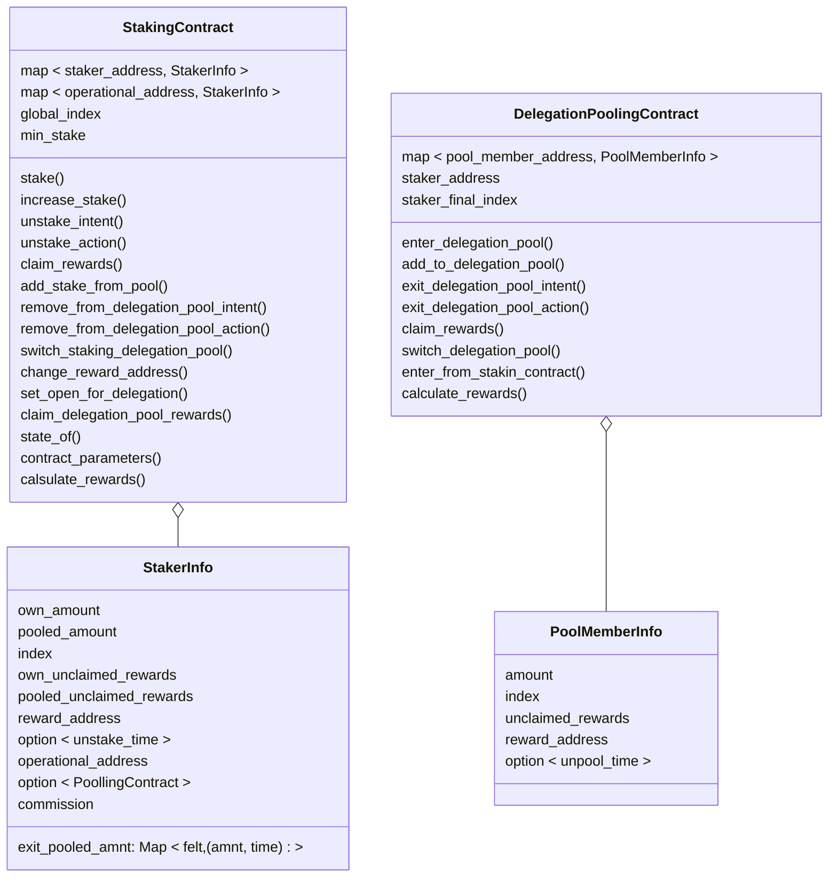
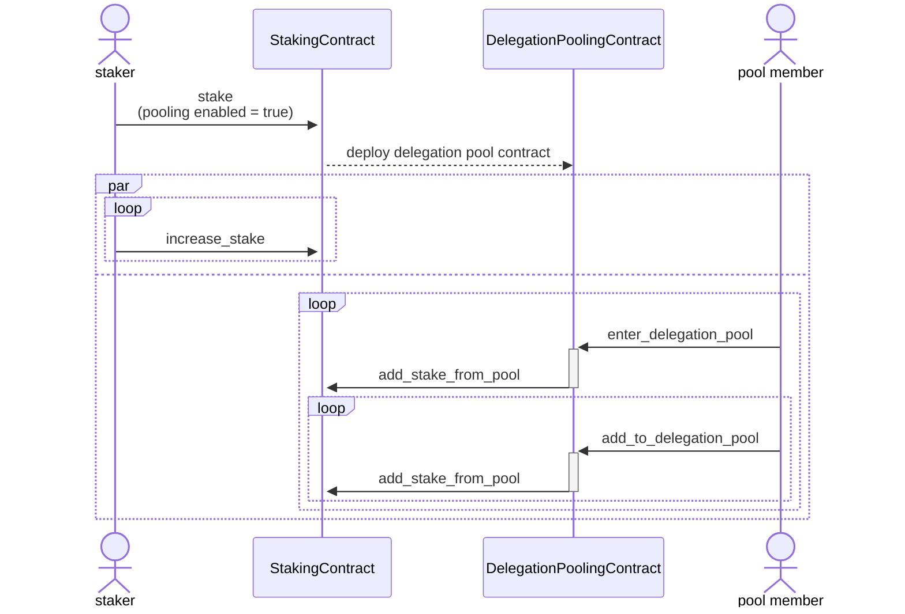
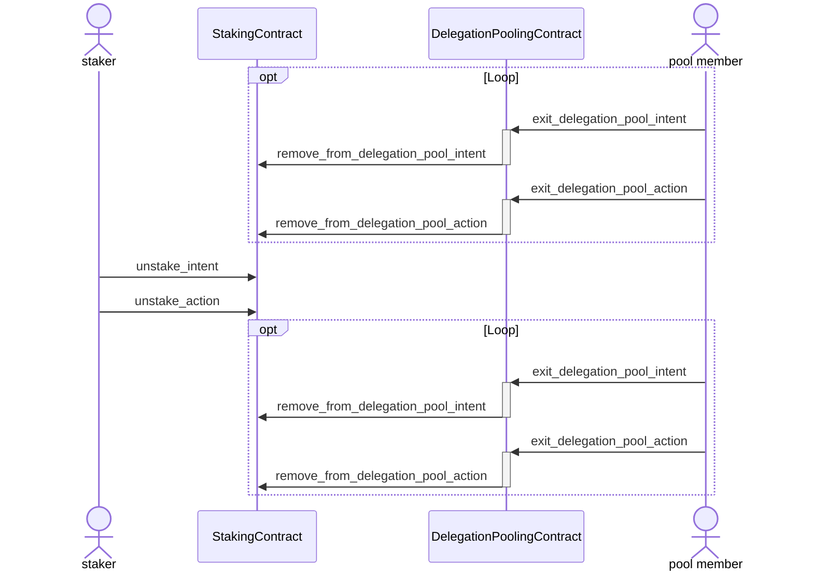
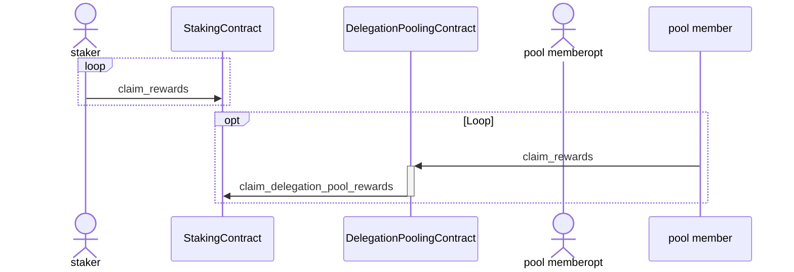
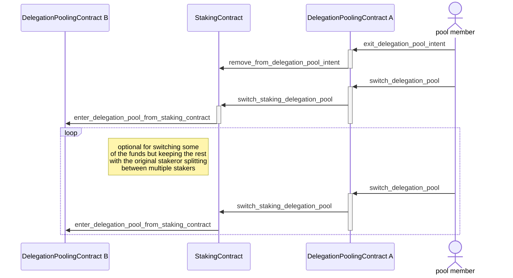

# Spec <!-- omit from toc -->
<details>
    <summary><strong style="font-size: 1.5em;">Table of contents</strong></summary>

- [Diagrams](#diagrams)
  - [Contracts block diagram](#contracts-block-diagram)
  - [Enter protocol flow diagram](#enter-protocol-flow-diagram)
  - [Exit protocol flow diagram](#exit-protocol-flow-diagram)
  - [Rewards claim flow diagram](#rewards-claim-flow-diagram)
  - [Delegation pool switching flow diagram](#delegation-pool-switching-flow-diagram)
- [Staking contract](#staking-contract)
  - [Functions](#functions)
    - [stake](#stake)
    - [increase\_stake](#increase_stake)
    - [unstake\_intent](#unstake_intent)
    - [unstake\_action](#unstake_action)
    - [claim\_rewards](#claim_rewards)
    - [add\_stake\_from\_pool](#add_stake_from_pool)
    - [remove\_from\_delegation\_pool\_intent](#remove_from_delegation_pool_intent)
    - [remove\_from\_delegation\_pool\_action](#remove_from_delegation_pool_action)
    - [switch\_staking\_delegation\_pool](#switch_staking_delegation_pool)
    - [change\_reward\_address](#change_reward_address)
    - [set\_open\_for\_delegation](#set_open_for_delegation)
    - [claim\_delegation\_pool\_rewards](#claim_delegation_pool_rewards)
    - [state\_of](#state_of)
    - [contract\_parameters](#contract_parameters)
    - [get\_total\_stake](#get_total_stake)
    - [calculate\_rewards](#calculate_rewards)
    - [change\_operational\_address](#change_operational_address)
    - [update\_commission](#update_commission)
  - [Events](#events)
    - [Stake Balance Changed](#stake-balance-changed)
    - [New Delegation Pool](#new-delegation-pool)
    - [Staker Exit Intent](#staker-exit-intent)
    - [Rewards Supplied To Delegation Pool](#rewards-supplied-to-delegation-pool)
    - [Delete Staker](#delete-staker)
    - [Staker Reward Claimed](#staker-reward-claimed)
    - [Staker Reward Address Changed](#staker-reward-address-changed)
    - [Operational Address Changed](#operational-address-changed)
    - [Commission Changed](#commission-changed)
    - [Global Index Updated](#global-index-updated)
- [Delegation pooling contract](#delegation-pooling-contract)
  - [Functions](#functions-1)
    - [enter\_delegation\_pool](#enter_delegation_pool)
    - [add\_to\_delegation\_pool](#add_to_delegation_pool)
    - [exit\_delegation\_pool\_intent](#exit_delegation_pool_intent)
    - [exit\_delegation\_pool\_action](#exit_delegation_pool_action)
    - [claim\_rewards](#claim_rewards-1)
    - [switch\_delegation\_pool](#switch_delegation_pool)
    - [enter\_delegation\_pool\_from\_staking\_contract](#enter_delegation_pool_from_staking_contract)
    - [set\_final\_staker\_index](#set_final_staker_index)
    - [calculate\_rewards](#calculate_rewards-1)
    - [update\_commission](#update_commission-1)
  - [Events](#events-1)
    - [New Staking Delegation Pool Member](#new-staking-delegation-pool-member)
    - [Delegation Pool Member Balance Changed](#delegation-pool-member-balance-changed)
    - [Pool Member Exit Intent](#pool-member-exit-intent)
    - [Final Index Set](#final-index-set)
    - [New Pool Member](#new-pool-member)
    - [Delete Pool Member](#delete-pool-member)
- [Errors](#errors)
    - [STAKER\_EXISTS](#staker_exists)
    - [STAKER\_NOT\_EXISTS](#staker_not_exists)
    - [OPERATIONAL\_EXISTS](#operational_exists)
    - [AMOUNT\_LESS\_THAN\_MIN\_STAKE](#amount_less_than_min_stake)
    - [COMMISSION\_OUT\_OF\_RANGE](#commission_out_of_range)
    - [CONTRACT\_IS\_PAUSED](#contract_is_paused)
    - [UNSTAKE\_IN\_PROGRESS](#unstake_in_progress)
    - [CALLER\_CANNOT\_INCREASE\_STAKE](#caller_cannot_increase_stake)
    - [MISSING\_UNSTAKE\_INTENT](#missing_unstake_intent)
    - [INTENT\_WINDOW\_NOT\_FINISHED](#intent_window_not_finished)
    - [UNEXPECTED\_BALANCE](#unexpected_balance)
    - [ONLY\_OPERATOR](#only_operator)
    - [FINAL\_STAKER\_INDEX\_ALREADY\_SET](#final_staker_index_already_set)
    - [CLAIM\_REWARDS\_FROM\_UNAUTHORIZED\_ADDRESS](#claim_rewards_from_unauthorized_address)
    - [CALLER\_IS\_NOT\_POOL\_CONTRACT](#caller_is_not_pool_contract)
    - [MISSING\_POOL\_CONTRACT](#missing_pool_contract)
    - [AMOUNT\_TOO\_HIGH](#amount_too_high)
    - [MISSMATCHED\_DELEGATION\_POOL](#missmatched_delegation_pool)
    - [MISSING\_UNDELEGATE\_INTENT](#missing_undelegate_intent)
    - [STAKER\_ALREADY\_HAS\_POOL](#staker_already_has_pool)
    - [CANNOT\_INCREASE\_COMMISSION](#cannot_increase_commission)
    - [STAKER\_INACTIVE](#staker_inactive)
    - [POOL\_MEMBER\_EXISTS](#pool_member_exists)
    - [AMOUNT\_IS\_ZERO](#amount_is_zero)
    - [POOL\_MEMBER\_DOES\_NOT\_EXIST](#pool_member_does_not_exist)
    - [UNDELEGATE\_IN\_PROGRESS](#undelegate_in_progress)
    - [CALLER\_CANNOT\_ADD\_TO\_POOL](#caller_cannot_add_to_pool)
    - [POOL\_CLAIM\_REWARDS\_FROM\_UNAUTHORIZED\_ADDRESS](#pool_claim_rewards_from_unauthorized_address)
    - [CALLER\_IS\_NOT\_STAKING\_CONTRACT](#caller_is_not_staking_contract)
    - [SWITCH\_POOL\_DATA\_DESERIALIZATION\_FAILED](#switch_pool_data_deserialization_failed)
- [Structs](#structs)
    - [StakerPoolInfo](#stakerpoolinfo)
    - [StakerInfo](#stakerinfo)
    - [StakingContractInfo](#stakingcontractinfo)

</details>

<!--
function info template:
#### description
#### parameters
| name | type |
| ---- | ---- |
#### return 
#### emits
#### errors
#### pre-condition
#### access control
#### logic
-->
# Diagrams
## Contracts block diagram


## Enter protocol flow diagram


## Exit protocol flow diagram


## Rewards claim flow diagram


## Delegation pool switching flow diagram



# Staking contract
## Functions
### stake
```rust
fn stake(
  ref self: TContractState,
  reward_address: ContractAddress,
  operational_address: ContractAddress,
  amount: u128,
  pooling_enabled: bool,
  commission: u16
) -> bool
```
#### description <!-- omit from toc -->
Add a new staker to the stake.
#### emits <!-- omit from toc -->
1. [New Delegation Pool](#new-delegation-pool) - if `pooling_enabled` is true
2. [Stake Balance Changed](#stake-balance-changed)
#### errors <!-- omit from toc -->
1. [CONTRACT\_IS\_PAUSED](#contract_is_paused)
2. [ONLY\_OPERATOR](#only_operator)
3. [STAKER\_EXISTS](#staker_exists)
4. [OPERATIONAL\_EXISTS](#operational_exists)
5. [AMOUNT\_LESS\_THAN\_MIN\_STAKE](#amount_less_than_min_stake)
6. [COMMISSION\_OUT\_OF\_RANGE](#commission_out_of_range)
#### pre-condition <!-- omit from toc -->
1. Staking contract is unpaused.
2. Staker (caller)  has operator role.
3. Staker (caller) is not listed in the contract.
4. `operational_address` is not listed in the contract.
5. `amount` is above the minimum amount for staking.
6. `commission` is not above the maximum commission for staking.
#### access control <!-- omit from toc -->
Only staker address.
#### logic  <!-- omit from toc -->
1. Transfer amount from staker to be locked in the contract.
2. Create a new registry for the staker (caller).
3. Set:
   1. Staker index = current global index.
   2. Unclaimed amount = 0.
   3. amount = given amount.
4. If pooling enabled then deploy a pooling contract instance.

### increase_stake
```rust
fn increase_stake(
    ref self: ContractState, 
    staker_address: ContractAddress, 
    amount: u128
) -> u128
``` 
#### description <!-- omit from toc -->
Increase the amount staked for an existing staker.
Return the updated total amount.
#### emits <!-- omit from toc -->
[Stake Balance Changed](#stake-balance-changed)
#### errors <!-- omit from toc -->
1. [CONTRACT\_IS\_PAUSED](#contract_is_paused)
2. [ONLY\_OPERATOR](#only_operator)
3. [STAKER\_NOT\_EXISTS](#staker_not_exists)
4. [UNSTAKE\_IN\_PROGRESS](#unstake_in_progress)
5. [CALLER\_CANNOT\_INCREASE\_STAKE](#caller_cannot_increase_stake)
#### pre-condition <!-- omit from toc -->
1. Staking contract is unpaused.
2. `caller_address` has operator role.
3. Staker is listed in the contract.
4. Staker is not in an exit window.
#### access control <!-- omit from toc -->
Only the staker address or rewards address for which the change is requested for.
#### logic <!-- omit from toc -->
1. [Calculate rewards](#calculate_rewards).
2. Increase staked amount.

### unstake_intent
```rust
fn unstake_intent(ref self: ContractState) -> u64
```
#### description <!-- omit from toc -->
Inform of the intent to exit the stake. 
This will remove the funds from the stake, pausing rewards collection for the staker and it's pool members (if exist).
This will also start the exit window timeout.
Return the time in which the staker will be able to unstake.
#### emits <!-- omit from toc -->
1. [Staker Exit Intent](#staker-exit-intent)
2. [Stake Balance Changed](#stake-balance-changed)
#### errors <!-- omit from toc -->
1. [CONTRACT\_IS\_PAUSED](#contract_is_paused)
2. [ONLY\_OPERATOR](#only_operator)
3. [STAKER\_NOT\_EXISTS](#staker_not_exists)
4. [UNSTAKE\_IN\_PROGRESS](#unstake_in_progress)
#### pre-condition <!-- omit from toc -->
1. Staking contract is unpaused.
2. Staker (caller) has operator role.
3. Staker (caller) is listed in the contract.
4. Staker (caller) is not in an exit window.
#### access control <!-- omit from toc -->
Only the staker address for which the operation is requested for.
#### logic <!-- omit from toc -->
1. [Calculate rewards](#calculate_rewards).
2. Set unstake time.

### unstake_action
```rust
fn unstake_action(
  ref self: ContractState, 
  staker_address: ContractAddress
) -> u128
```
#### description <!-- omit from toc -->
Executes the intent to exit the stake if enough time have passed.
Transfers the funds back to the staker.
Return the amount of tokens transferred back to the staker.
#### emits <!-- omit from toc -->
1. [Staker Reward Claimed](#staker-reward-claimed)
2. If pool exists: [Rewards Supplied To Delegation Pool](#rewards-supplied-to-delegation-pool)
3. If pool exists: [Final Index Set](#final-index-set)
4. [Delete Staker](#delete-staker)
#### errors <!-- omit from toc -->
1. [CONTRACT\_IS\_PAUSED](#contract_is_paused)
2. [ONLY\_OPERATOR](#only_operator)
3. [STAKER\_NOT\_EXISTS](#staker_not_exists)
4. [MISSING\_UNSTAKE\_INTENT](#missing_unstake_intent)
5. [INTENT\_WINDOW\_NOT\_FINISHED](#intent_window_not_finished)
6. [UNEXPECTED\_BALANCE](#unexpected_balance)
7. [FINAL\_STAKER\_INDEX\_ALREADY\_SET](#final_staker_index_already_set)
#### pre-condition <!-- omit from toc -->
1. Staking contract is unpaused.
2. Staker (caller) has operator role.
3. Staker exist and requested to unstake.
4. Enough time have passed from the unstake intent call.
#### access control <!-- omit from toc -->
Any address can execute.
#### logic <!-- omit from toc -->
1. Claim rewards.
2. Remove funds and transfer to staker.
3. Transfer pool unclaimed rewards and stake to delegation pool contract.
4. Call [set\_final\_staker\_index](#set_final_staker_index) on the delegation_pool_contract.
5. Delete staker record.

### claim_rewards
```rust
fn claim_rewards(
  ref self: ContractState, 
  staker_address: ContractAddress
) -> u128
```
#### description <!-- omit from toc -->
Calculate rewards and transfer them to the reward address.
Return the amount of tokens transferred to the reward address.
#### emits <!-- omit from toc -->
1. [Staker Reward Claimed](#staker-reward-claimed)
#### errors <!-- omit from toc -->
1. [CONTRACT\_IS\_PAUSED](#contract_is_paused)
2. [ONLY\_OPERATOR](#only_operator)
3. [STAKER\_NOT\_EXISTS](#staker_not_exists)
4. [CLAIM\_REWARDS\_FROM\_UNAUTHORIZED\_ADDRESS](#claim_rewards_from_unauthorized_address)
#### pre-condition <!-- omit from toc -->
1. Staking contract is unpaused.
2. `caller_address` has operator role.
3. Staker is listed in the contract.
#### access control <!-- omit from toc -->
Only staker address or reward address can execute.
#### logic <!-- omit from toc -->
1. [Calculate rewards](#calculate_rewards).
2. Transfer unclaimed_rewards.
3. Set unclaimed_rewards = 0.

### add_stake_from_pool
```rust
fn add_stake_from_pool(
    ref self: ContractState, 
    staker_address: ContractAddress, 
    amount: u128
) -> (u128, u64)
```
#### description <!-- omit from toc -->
Delegation pool contract's way to add funds to the staking pool.
#### return <!-- omit from toc -->
pool_amount: u128 - total pool amount after addition.
index: u64 - updated index
#### emits <!-- omit from toc -->
1. [Stake Balance Changed](#stake-balance-changed)
#### errors <!-- omit from toc -->
1. [CONTRACT\_IS\_PAUSED](#contract_is_paused)
2. [ONLY\_OPERATOR](#only_operator)
3. [STAKER\_NOT\_EXISTS](#staker_not_exists)
4. [UNSTAKE\_IN\_PROGRESS](#unstake_in_progress)
5. [MISSING\_POOL\_CONTRACT](#missing_pool_contract)
6. [CALLER\_IS\_NOT\_POOL\_CONTRACT](#caller_is_not_pool_contract)
#### pre-condition <!-- omit from toc -->
1. Staking contract is unpaused.
2. Pool contract (caller) has operator role.
3. Staker is listed in the contract.
4. Staker is not in an exit window.
5. Staker has pool contract.
#### access control <!-- omit from toc -->
Only pool contract for the given staker can execute.
#### logic <!-- omit from toc -->
1. [Calculate rewards](#calculate_rewards)
2. transfer funds from pooling contract to staking contract.
3. Add amount to staker's pooled amount

### remove_from_delegation_pool_intent
```rust
fn remove_from_delegation_pool_intent(
    ref self: ContractState,
    staker_address: ContractAddress,
    identifier: felt252,
    amount: u128,
) -> u64
```
#### description <!-- omit from toc -->
Inform the staker that an amount will be reduced from the delegation pool.
Return the time in which the pool member will be able to exit.
#### emits <!-- omit from toc -->
1. [Stake Balance Changed](#stake-balance-changed)
#### errors <!-- omit from toc -->
1. [CONTRACT\_IS\_PAUSED](#contract_is_paused)
2. [ONLY\_OPERATOR](#only_operator)
3. [STAKER\_NOT\_EXISTS](#staker_not_exists)
4. [MISSING\_POOL\_CONTRACT](#missing_pool_contract)
5. [CALLER\_IS\_NOT\_POOL\_CONTRACT](#caller_is_not_pool_contract)
6. [AMOUNT\_TOO\_HIGH](#amount_too_high)
#### pre-condition <!-- omit from toc -->
1. Staking contract is unpaused.
2. Pool contract (caller) has operator role.
3. Staker is listed in the contract.
4. Staker has pool contract.
5. Pooled amount is greater or equal then amount requested to remove.
#### access control <!-- omit from toc -->
Only pool contract for the given staker can execute.
#### logic <!-- omit from toc -->
1. [Calculate rewards](#calculate_rewards).
2. Remove amount from staker's pooled amount.
3. Register intent with given identifier, amount and unstake_time.

### remove_from_delegation_pool_action
```rust
fn remove_from_delegation_pool_action(
    ref self: ContractState, 
    identifier: felt252
) -> u128
```
#### description <!-- omit from toc -->
Execute the intent to remove funds from pool if enough time have passed.
Transfers the funds to the pool contract.
Return the amount being transferred to the pool contract.
#### emits <!-- omit from toc -->
#### errors <!-- omit from toc -->
1. [CONTRACT\_IS\_PAUSED](#contract_is_paused)
2. [ONLY\_OPERATOR](#only_operator)
3. [INTENT\_WINDOW\_NOT\_FINISHED](#intent_window_not_finished)
#### pre-condition <!-- omit from toc -->
1. Staking contract is unpaused.
2. `caller_address` has operator role.
3. Removal intent request with the given `identifier` have been sent before.
4. Enough time have passed since the intent request.
#### access control <!-- omit from toc -->
Any address can execute.
#### logic <!-- omit from toc -->
1. Transfer funds from staking contract to pool contract.
2. Remove intent from staker's list.

### switch_staking_delegation_pool
```rust
fn switch_staking_delegation_pool(
    ref self: ContractState,
    to_staker: ContractAddress,
    to_pool: ContractAddress,
    switched_amount: u128,
    data: Span<felt252>,
    identifier: felt252
) -> bool
```
#### description <!-- omit from toc -->
Execute a pool member request to move from one staker's delegation pool to another staker's delegation pool.
Return true upon success, otherwise return false.
#### emits <!-- omit from toc -->
1. [Delegation Pool Member Balance Changed](#delegation-pool-member-balance-changed)
#### errors <!-- omit from toc -->
1. [CONTRACT\_IS\_PAUSED](#contract_is_paused)
2. [ONLY\_OPERATOR](#only_operator)
3. [MISSING\_UNDELEGATE\_INTENT](#missing_undelegate_intent)
4. [AMOUNT\_TOO\_HIGH](#amount_too_high)
5. [STAKER\_NOT\_EXISTS](#staker_not_exists)
6. [UNSTAKE\_IN\_PROGRESS](#unstake_in_progress)
7. [MISSING\_POOL\_CONTRACT](#missing_pool_contract)
8. [MISSMATCHED\_DELEGATION\_POOL](#missmatched_delegation_pool)
#### pre-condition <!-- omit from toc -->
1. Staking contract is unpaused.
2. Pool contract (caller) has operator role.
3. `switched_amount` is not zero.
4. Enough funds is in intent for switching.
5. `to_staker` exist in the contract and is not in exit window.
6. `to_pool` is the delegation pool contract for `to_staker`.
#### access control <!-- omit from toc -->
Only pool contract for the given staker can execute.
#### logic <!-- omit from toc -->
1. [Calculate rewards](#calculate_rewards).
2. Remove requested amount from the caller pool intent amount.
3. Add requested amount to `to_staker`'s pool with pool contract address `to_pool`.
4. Call `to_pool`'s [enter\_delegation\_pool\_from\_staking\_contract](#enter_delegation_pool_from_staking_contract) function.

### change_reward_address
```rust
fn change_reward_address(
  ref self: ContractState, 
  reward_address: ContractAddress
) -> bool
```
#### description <!-- omit from toc -->
Change the reward address for a staker.
#### emits <!-- omit from toc -->
1. [Staker Reward Address Changed](#staker-reward-address-changed)
#### errors <!-- omit from toc -->
1. [CONTRACT\_IS\_PAUSED](#contract_is_paused)
2. [ONLY\_OPERATOR](#only_operator)
3. [STAKER\_NOT\_EXISTS](#staker_not_exists)
#### pre-condition <!-- omit from toc -->
1. Staking contract is unpaused.
2. Staker (caller) has operator role.
3. Staker (caller) exist in the contract.
#### access control <!-- omit from toc -->
Only staker address.
#### logic <!-- omit from toc -->
1. Change registered `reward_address` for the staker.

### set_open_for_delegation
```rust
fn set_open_for_delegation(
  ref self: ContractState, 
  commission: u16
) -> ContractAddress
```
#### description <!-- omit from toc -->
Creates a staking delegation pool for a staker that doesn't have one.
Return the pool address.
#### emits <!-- omit from toc -->
1. [New Delegation Pool](#new-delegation-pool)
#### errors <!-- omit from toc -->
1. [CONTRACT\_IS\_PAUSED](#contract_is_paused)
2. [ONLY\_OPERATOR](#only_operator)
3. [STAKER\_NOT\_EXISTS](#staker_not_exists)
4. [COMMISSION\_OUT\_OF\_RANGE](#commission_out_of_range)
5. [STAKER\_ALREADY\_HAS\_POOL](#staker_already_has_pool)
#### pre-condition <!-- omit from toc -->
1. Staking contract is unpaused.
2. Staker (caller) has operator role.
3. Staker (caller) exist in the contract.
4. `commission` is in valid range.
5. Staker has no pool.
#### access control <!-- omit from toc -->
Only staker address.
#### logic <!-- omit from toc -->
1. Generate pool contract for staker.
2. Register pool.

### claim_delegation_pool_rewards
```rust
fn claim_delegation_pool_rewards(
    ref self: ContractState, 
    staker_address: ContractAddress
) -> u64
```
#### description <!-- omit from toc -->
Calculate rewards and transfer the delegation pool rewards to the delegation pool contract.
Return the updated staker index.
#### emits <!-- omit from toc -->
[Rewards Supplied To Delegation Pool](#rewards-supplied-to-delegation-pool)
#### errors <!-- omit from toc -->
1. [CONTRACT\_IS\_PAUSED](#contract_is_paused)
2. [ONLY\_OPERATOR](#only_operator)
3. [STAKER\_NOT\_EXISTS](#staker_not_exists)
4. [MISSING\_POOL\_CONTRACT](#missing_pool_contract)
5. [CALLER\_IS\_NOT\_POOL\_CONTRACT](#caller_is_not_pool_contract)
6. [AMOUNT\_TOO\_HIGH](#amount_too_high)
7. [UNEXPECTED\_BALANCE](#unexpected_balance)
#### pre-condition <!-- omit from toc -->
1. Staking contract is unpaused.
2. Pool contract (caller) has operator role.
3. Staker exist in the contract.
4. Delegation pool exist for the staker.
#### access control <!-- omit from toc -->
Delegation pool contract of the given staker.
#### logic <!-- omit from toc -->
1. [Calculate rewards](#calculate_rewards)
2. Transfer rewards to pool contract.

### state_of
```rust
fn state_of(
  self: @ContractState, 
  staker_address: ContractAddress
) -> StakerInfo
```
#### description <!-- omit from toc -->
Return [StakerInfo](#stakerinfo) of the given staker.
#### emits <!-- omit from toc -->
#### errors <!-- omit from toc -->
3. [STAKER\_NOT\_EXISTS](#staker_not_exists)
#### pre-condition <!-- omit from toc -->
1. Staker exist in the contract.
#### access control <!-- omit from toc -->
Any address can execute.
#### logic <!-- omit from toc -->
1. Return Staker's info.

### contract_parameters
```rust
fn contract_parameters(self: @ContractState) -> StakingContractInfo
```
#### description <!-- omit from toc -->
Return general parameters of the contract.
#### emits <!-- omit from toc -->
#### errors <!-- omit from toc -->
#### pre-condition <!-- omit from toc -->
#### access control <!-- omit from toc -->
#### logic <!-- omit from toc -->

### get_total_stake
```rust
get_total_stake(self: @ContractState) -> u128
```
#### description <!-- omit from toc -->
Return the total stake amount.
#### emits <!-- omit from toc -->
#### errors <!-- omit from toc -->
#### pre-condition <!-- omit from toc -->
#### access control <!-- omit from toc -->
#### logic <!-- omit from toc -->


### calculate_rewards
>**note:** internal logic
```rust
fn calculate_rewards(
  ref self: ContractState, 
  ref staker_info: StakerInfo
) -> bool
```
#### description <!-- omit from toc -->
Calculate rewards, add amount to unclaimed_rewards, update index.
#### emits <!-- omit from toc -->
#### errors <!-- omit from toc -->
#### pre-condition <!-- omit from toc -->
#### access control <!-- omit from toc -->
Internal function.
#### logic <!-- omit from toc -->
1. If Staker is in an exit window, return false.
2. Update index.
3. Calculate rewards for `amount_own`.
4. Calculate rewards for `pool_info.amount`.
5. Update `unclaimed_rewards_own` with own rewards + pool rewards commission.
6. Update `pool_info.unclaimed_rewards` with pool rewards without commission. 

### change_operational_address
```rust
fn change_operational_address(
    ref self: ContractState, 
    operational_address: ContractAddress
) -> bool
```
#### description <!-- omit from toc -->
Change the operational address for a staker.
#### emits <!-- omit from toc -->
1. [Operational Address Changed](#operational-address-changed)
#### errors <!-- omit from toc -->
1. [CONTRACT\_IS\_PAUSED](#contract_is_paused)
2. [ONLY\_OPERATOR](#only_operator)
3. [STAKER\_NOT\_EXISTS](#staker_not_exists)
#### pre-condition <!-- omit from toc -->
1. Staking contract is unpaused.
2. Staker (caller) has operator role.
3. Staker (caller) exist in the contract.
#### access control <!-- omit from toc -->
Only staker address.
#### logic <!-- omit from toc -->
1. Change registered `operational_address` for the staker.

### update_commission
```rust
fn update_commission(
  ref self: ContractState, 
  commission: u16
) -> bool
```
#### description <!-- omit from toc -->
Update commission. 
#### emits <!-- omit from toc -->
1. [Commission Changed](#commission-changed)
#### errors <!-- omit from toc -->
1. [CONTRACT\_IS\_PAUSED](#contract_is_paused)
2. [ONLY\_OPERATOR](#only_operator)
3. [STAKER\_NOT\_EXISTS](#staker_not_exists)
4. [MISSING\_POOL\_CONTRACT](#missing_pool_contract)
5. [CANNOT\_INCREASE\_COMMISSION](#cannot_increase_commission)
#### pre-condition <!-- omit from toc -->
1. Staking contract is unpaused.
2. Staker (caller) has operator role.
3. Staker (caller) exist in the contract.
4. Staker (caller) has pool contract.
5. `commission` is lower or equal to staker current commission
#### access control <!-- omit from toc -->
Only staker address.
#### logic <!-- omit from toc -->
1. [Calculate rewards](#calculate_rewards)
2. Update staker's commission to be the given commission.
3. Call pool's [update\_commission](#update_commission-1)

## Events
### Stake Balance Changed
| data                | type            | keyed  |
| ------              | -------         | -----  |
| staker_address      | address         | ✅     |
| old_self_stake      | u128            | ❌     |
| old_delegated_stake | u128            | ❌     |
| new_self_stake      | u128            | ❌     |
| new_delegated_stake | u128            | ❌     |

### New Delegation Pool
| data           | type    | keyed |
| -------------- | ------- | ----- |
| staker_address | address | ✅    |
| pool_contract  | address | ✅    |
| commission     | u16     | ❌    |


### Staker Exit intent
| data    | type    | keyed |
| ------- | ------- | ----- |
| staker  | address | ✅     |
| exit_at | time    | ❌     |

### Rewards Supplied To Delegation Pool
| data           | type    | keyed |
| -------------- | ------- | ----- |
| staker_address | address | ✅    |
| pool_address   | address | ✅    |
| amount         | u128    | ❌    |

### Delete Staker
| data                | type            | keyed |
| ------------------- | --------------- | ----- |
| staker_address      | address         | ✅    |
| reward_address      | address         | ❌    |
| operational_address | address         | ❌    |
| pool_contract       | Option<address> | ❌    |

### Staker Reward Claimed
| data           | type    | keyed |
| -------------- | ------- | ----- |
| staker_address | address | ✅    |
| reward_address | address | ❌    |
| amount         | u128    | ❌    |

### Staker Reward Address Changed
| data           | type    | keyed |
| -------------- | ------- | ----- |
| staker_address | address | ✅    |
| new_address    | address | ❌    |
| old_address    | address | ❌    |

### Operational Address Changed
| data           | type    | keyed |
| -------------- | ------- | ----- |
| staker_address | address | ✅    |
| new_address    | address | ❌    |
| old_address    | address | ❌    |

### Commission Changed
| data           | type    | keyed |
| -------------- | ------- | ----- |
| staker_address | address | ✅    |
| pool_contract  | address | ✅    |
| new_commission | u16     | ❌    |
| old_commission | u16     | ❌    |

### Global Index Updated
| data                                  | type | keyed |
| ------------------------------------- | ---- | ----- |
| old_index                             | u64  | ❌    |
| new_index                             | u64  | ❌    |
| global_index_last_update_timestamp    | u64  | ❌    |
| global_index_current_update_timestamp | u64  | ❌    |

# Delegation pooling contract

## Functions
### enter_delegation_pool
```rust
fn enter_delegation_pool(
    ref self: ContractState, 
    reward_address: ContractAddress, 
    amount: u128
) -> bool
```
#### description <!-- omit from toc -->
Add a new pool member to the delegation pool.
#### emits <!-- omit from toc -->
1. [Stake Balance Changed](#stake-balance-changed)
2. [New Pool Member](#new-pool-member)
3. [Delegation Pool Member Balance Changed](#delegation-pool-member-balance-changed)
#### errors <!-- omit from toc -->
1. [STAKER\_INACTIVE](#staker_inactive)
2. [POOL\_MEMBER\_EXISTS](#pool_member_exists)
3. [AMOUNT\_IS\_ZERO](#amount_is_zero)
4. [INSUFFICIENT\_ALLOWANCE](#insufficient_allowance)
5. [UNSTAKE\_IN\_PROGRESS](#unstake_in_progress)
#### pre-condition <!-- omit from toc -->
1. Staker is active and not in an exit window.
2. `caller_address` is not listed in the contract as a pool member.
3. `amount` is not zero.
4. `caller_address` has enough funds.
#### access control <!-- omit from toc -->
Only a non-listed pool member address.
#### logic <!-- omit from toc -->
1. Transfer funds from pool member to pooling contract.
2. Approve transferal from pooling contract to staking contract.
3. Call staking contract's [add_stake_from_pool](#add_stake_from_pool).
4. Get current index from staking contract.
5. Create entry for pool member.

### add_to_delegation_pool
```rust
fn add_to_delegation_pool(
    ref self: ContractState, 
    pool_member: ContractAddress, 
    amount: u128
) -> u128
```
#### description <!-- omit from toc -->
Increase the funds for an existing pool member.
Return the updated total amount.
#### emits <!-- omit from toc -->
1. [Stake Balance Changed](#stake-balance-changed)
2. [Delegation Pool Member Balance Changed](#delegation-pool-member-balance-changed)
#### errors <!-- omit from toc -->
1. [STAKER\_INACTIVE](#staker_inactive)
2. [POOL\_MEMBER\_DOES\_NOT\_EXIST](#pool_member_does_not_exist)
3. [CALLER\_CANNOT\_ADD\_TO\_POOL](#caller_cannot_add_to_pool)
4. [UNSTAKE\_IN\_PROGRESS](#unstake_in_progress)
#### pre-condition <!-- omit from toc -->
1. Staker is active and not in an exit window.
2. `pool_member` listed in the contract.
3. `pool_member` has enough funds.
#### access control <!-- omit from toc -->
Only the pool member address or rewards address for which the change is requested for.
#### logic <!-- omit from toc -->
1. Transfer funds from caller to the contract.
2. Call staking contract's [add_stake_from_pool](#add_stake_from_pool).
3. Get current index from staking contract.
4. [Calculate rewards](#calculate_rewards-1)
5. Update pool member entry with
   1. index
   2. amount
   3. unclaimed rewards

### exit_delegation_pool_intent
```rust
fn exit_delegation_pool_intent(
  ref self: ContractState, 
  amount: u128
)
```
#### description <!-- omit from toc -->
Inform of the intent to exit the stake. This will remove the funds from the stake, pausing rewards collection for the pool member. This will also start the exit window timeout.
#### emits <!-- omit from toc -->
1. If staker is active: [Rewards Supplied To Delegation Pool](#rewards-supplied-to-delegation-pool)
2. If staker is active: [Stake Balance Changed](#stake-balance-changed)
3. [Pool Member Exit Intent](#pool-member-exit-intent)
#### errors <!-- omit from toc -->
1. [POOL\_MEMBER\_DOES\_NOT\_EXIST](#pool_member_does_not_exist)
2. [AMOUNT\_TOO\_HIGH](#amount_too_high)
3. [UNDELEGATE\_IN\_PROGRESS](#undelegate_in_progress)
4. [CONTRACT\_IS\_PAUSED](#contract_is_paused)
5. [ONLY\_OPERATOR](#only_operator)
#### pre-condition <!-- omit from toc -->
1. Pool member (caller) is listed in the contract.
2. `amount` is lower or equal to the total amount of the pool member (caller). 
3. Pool member (caller) is not in an exit window or staker is active.
4. Staking contract is unpaused.
#### access control <!-- omit from toc -->
Only the pool member address for which the operation is requested for.
#### logic <!-- omit from toc -->
1. [Calculate rewards](#calculate_rewards-1)
2. If staker is active, call [remove from delegation pool intent](#remove_from_delegation_pool_intent)
3. If `amount` is zero, remove request for intent (if exist).
4. If `amount` is not zero, set exit window timeout.

### exit_delegation_pool_action
```rust
fn exit_delegation_pool_action(
    ref self: ContractState, 
    pool_member: ContractAddress
) -> u128
```
#### description <!-- omit from toc -->
Executes the intent to exit the stake if enough time have passed. Transfers the funds back to the pool member.
Return the amount of tokens transferred back to the pool member.
#### emits <!-- omit from toc -->
1. [Pool Member Reward Claimed](#pool-member-reward-claimed)
2. [Delete Pool Member](#delete-pool-member)
#### errors <!-- omit from toc -->
1. [POOL\_MEMBER\_DOES\_NOT\_EXIST](#pool_member_does_not_exist)
2. [MISSING\_UNDELEGATE\_INTENT](#missing_undelegate_intent)
3. [INTENT\_WINDOW\_NOT\_FINISHED](#intent_window_not_finished)
4. [CONTRACT\_IS\_PAUSED](#contract_is_paused)
5. [ONLY\_OPERATOR](#only_operator)
#### pre-condition <!-- omit from toc -->
1. Pool member exist and requested to unstake.
2. Enough time have passed from the delegation pool exit intent call.
#### access control <!-- omit from toc -->
Any address can execute.
#### logic <!-- omit from toc -->
1. [Remove from delegation pool action](#remove_from_delegation_pool_action).
2. Transfer rewards to pool member.
3. Transfer funds to pool member.


### claim_rewards
```rust
fn claim_rewards(
  ref self: ContractState, 
  pool_member: ContractAddress
) -> u128
```
#### description <!-- omit from toc -->
Calculate rewards and transfer them to the reward address.
Return the amount transferred to the reward address.
#### emits <!-- omit from toc -->
#### errors <!-- omit from toc -->
1. [POOL\_MEMBER\_DOES\_NOT\_EXIST](#pool_member_does_not_exist)
2. [POOL\_CLAIM\_REWARDS\_FROM\_UNAUTHORIZED\_ADDRESS](#pool_claim_rewards_from_unauthorized_address)
3. [CONTRACT\_IS\_PAUSED](#contract_is_paused)
4. [ONLY\_OPERATOR](#only_operator)
5. [UNEXPECTED\_BALANCE](#unexpected_balance)
6. [AMOUNT\_TOO\_HIGH](#amount_too_high)
#### pre-condition <!-- omit from toc -->
1. `pool_member` is listed in the contract.
#### access control <!-- omit from toc -->
Only pool member address or reward address can execute.
#### logic <!-- omit from toc -->
1. [Calculate rewards](#calculate_rewards-1).
2. Transfer unclaimed_rewards
3. Set unclaimed_rewards = 0.

### switch_delegation_pool
```rust
fn switch_delegation_pool(
    ref self: ContractState,
    to_staker: ContractAddress,
    to_pool: ContractAddress,
    amount: u128
) -> u128
```
#### description <!-- omit from toc -->
Request the staking contract to move a pool member to another pool contract.
Return the amount left in exit window for the pool member in this pool.
#### emits <!-- omit from toc -->
1. [Delegation Pool Member Balance Changed](#delegation-pool-member-balance-changed)
2. If pool member amount and intent amount are zero: [Delete Pool Member](#delete-pool-member)
#### errors <!-- omit from toc -->
1. [AMOUNT\_IS\_ZERO](#amount_is_zero)
2. [POOL\_MEMBER\_DOES\_NOT\_EXIST](#pool_member_does_not_exist)
3. [MISSING\_UNDELEGATE\_INTENT](#missing_undelegate_intent)
4. [AMOUNT\_TOO\_HIGH](#amount_too_high)
5. [CONTRACT\_IS\_PAUSED](#contract_is_paused)
6. [ONLY\_OPERATOR](#only_operator)
7. [UNSTAKE\_IN\_PROGRESS](#unstake_in_progress)
8. [MISSMATCHED\_DELEGATION\_POOL](#missmatched_delegation_pool)
#### pre-condition <!-- omit from toc -->
1. `amount` is not zero.
2. Pool member (caller) is in exit window.
3. Pool member's amount is greater or equal to the amount requested.
4. `to_staker` exist in the staking contract and is not in an exit window.
5. `to_pool` is the delegation pool contract for `to_staker`.
#### access control <!-- omit from toc -->
Only pool member can execute.
#### logic <!-- omit from toc -->
1. Compose and serialize data: pool member address and reward address.
2. If pool member amount and intent amount are zero, transfer rewards to pool member and remove him from the pool. 
3. Call staking contract's [switch delegation pool](#switch_staking_delegation_pool).

### enter_delegation_pool_from_staking_contract
```rust
fn enter_delegation_pool_from_staking_contract(
    ref self: ContractState, 
    amount: u128, 
    index: u64, 
    data: Span<felt252>
) -> bool
```
#### description <!-- omit from toc -->
Entry point for staking contract to inform pool of a pool member being moved from another pool to this one.
No funds need to be transferred since staking contract holds the pool funds.
#### emits <!-- omit from toc -->
1. [Delegation Pool Member Balance Changed](#delegation-pool-member-balance-changed)
#### errors <!-- omit from toc -->
1. [AMOUNT\_IS\_ZERO](#amount_is_zero)
2. [CALLER\_IS\_NOT\_STAKING\_CONTRACT](#caller_is_not_staking_contract)
3. [SWITCH\_POOL\_DATA\_DESERIALIZATION\_FAILED](#switch_pool_data_deserialization_failed)
#### pre-condition <!-- omit from toc -->
1. `amount` is not zero.
2. `pool_member` is not in an exit window.
#### access control <!-- omit from toc -->
Only staking contract can execute.
#### logic <!-- omit from toc -->
1. Deserialize data, get `pool_member` and `rewrad_address`.
2. If pool member is listed in the contract:
   1. [Calculate rewards](#calculate_rewards-1)
   2. Update pool member entry
3. Else
   1. Create an entry for the pool member.

### set_final_staker_index
#### description <!-- omit from toc -->
Informs the delegation pool contract that the staker has left and the contract is now detached from the staking contract.
#### parameters <!-- omit from toc -->
| name  | type |
| ----- | ---- |
| index | u64  |
#### return <!-- omit from toc -->
sucess: bool
#### emits <!-- omit from toc -->
#### errors <!-- omit from toc -->
#### pre-condition <!-- omit from toc -->
#### access control <!-- omit from toc -->
only staking contract can call
#### logic <!-- omit from toc -->
1. set staker final index to the provided index.

### calculate_rewards
>**note:** internal logic
#### description <!-- omit from toc -->
Calculate rewards, add amount to unclaimed_rewards, update index.
Assumes this function call is after an one of the interactions with the staking contract:
1. [add to delegation pool](#add_to_delegation_pool)
2. [claim delegation pool rewards](#claim_delegation_pool_rewards)
3. [exit delegation pool intent](#exit_delegation_pool_intent)
that perform rewards calculation and index update on the staker and returns the updated index.
#### parameters <!-- omit from toc -->
| name  | type |
| ----- | ---- |
| index | u64  |
#### return <!-- omit from toc -->
success: bool
#### emits <!-- omit from toc -->
#### errors <!-- omit from toc -->
#### pre-condition <!-- omit from toc -->
#### access control <!-- omit from toc -->
internal function.
#### logic <!-- omit from toc -->
1. Calculate rewards for pool member (caller).
2. Update `unclaimed_rewards`.
3. Update index.

### update_commission
#### description <!-- omit from toc -->
Update commission. 
#### parameters <!-- omit from toc -->
| name           | type |
| -----          | ---- |
| commission     | u16  |
#### return <!-- omit from toc -->
success: bool
#### emits <!-- omit from toc -->
#### errors <!-- omit from toc -->
#### pre-condition <!-- omit from toc -->
1. only staking contract can call.
2. given commission is lower or equal to pool contract's commission.
#### access control <!-- omit from toc -->
#### logic <!-- omit from toc -->
1. Update `commission` to be the given commission.

## Events
### New Staking Delegation Pool Member
| data        | type    | keyed |
| ----------- | ------- | ----- |
| staker      | address | ✅     |
| pool_member | address | ✅     |
| amount      | u128    | ❌     |

### Delegation Pool Member Balance Changed
| data                | type    | keyed |
| ------------------- | ------- | ----- |
| pool_member         | address | ✅    |
| old_delegated_stake | u128    | ❌    |
| new_delegated_stake | u128    | ❌    |

### Pool Member Exit Intent
| data        | type    | keyed |
| ----------- | ------- | ----- |
| pool_member | address | ✅     |
| exit_at     | time    | ❌     |

### Final Index Set
| data               | type    | keyed |
| ------------------ | ------- | ----- |
| staker_address     | address | ✅    |
| final_staker_index | u64     | ❌    |

### New Pool Member
| data           | type    | keyed |
| -------------- | ------- | ----- |
| pool_member    | address | ✅    |
| staker_address | address | ✅    |
| reward_address | address | ❌    |
| amount         | u128    | ❌    |

### Delete Pool Member
| data           | type    | keyed |
| -------------- | ------- | ----- |
| pool_member    | address | ✅    |
| reward_address | address | ❌    |

### Pool Member Reward Claimed
| data           | type    | keyed |
| -------------- | ------- | ----- |
| pool_member    | address |   ✅  |
| reward_address | address |   ✅  |
| amount         | u128    |   ❌  |
# Errors
### STAKER_EXISTS
"Staker already exists, use increase_stake instead."

### STAKER_NOT_EXISTS
"Staker does not exist."

### OPERATIONAL_EXISTS
"Operational address already exists."

### AMOUNT_LESS_THAN_MIN_STAKE
"Amount is less than min stake - try again with enough funds."

### COMMISSION_OUT_OF_RANGE
"Commission is out of range, expected to be 0-10000."

### CONTRACT_IS_PAUSED
"Contract is paused."

### UNSTAKE_IN_PROGRESS
"Unstake is in progress, staker is in an exit window."

### CALLER_CANNOT_INCREASE_STAKE
"Caller address should be staker address or reward address."

### MISSING_UNSTAKE_INTENT
"Unstake intent is missing."

### INTENT_WINDOW_NOT_FINISHED
"Intent window is not finished."

### UNEXPECTED_BALANCE
"Unexpected balance."

### ONLY_OPERATOR
"ONLY_OPERATOR"

### FINAL_STAKER_INDEX_ALREADY_SET
"Final staker index already set."

### CLAIM_REWARDS_FROM_UNAUTHORIZED_ADDRESS
"Claim rewards must be called from staker address or reward address."

### CALLER_IS_NOT_POOL_CONTRACT
"Caller is not pool contract."

### MISSING_POOL_CONTRACT
"Staker does not have a pool contract."

### AMOUNT_TOO_HIGH
"Amount is too high."

### MISSMATCHED_DELEGATION_POOL
"to_pool is not the delegation pool contract for to_staker."

### MISSING_UNDELEGATE_INTENT
"Undelegate intent is missing."

### STAKER_ALREADY_HAS_POOL
"Staker already has a pool."

### CANNOT_INCREASE_COMMISSION
"Commission cannot be increased."

### STAKER_INACTIVE
"Staker inactive."

### POOL_MEMBER_EXISTS
"Pool member exists, use add_to_delegation_pool instead."

### AMOUNT_IS_ZERO
"Amount is zero."

### POOL_MEMBER_DOES_NOT_EXIST
"Pool member does not exist."

### UNDELEGATE_IN_PROGRESS
"Undelegate from pool in progress, pool member is in an exit window."

### CALLER_CANNOT_ADD_TO_POOL
"Caller address should be pool member address or reward address."

### POOL_CLAIM_REWARDS_FROM_UNAUTHORIZED_ADDRESS
"Claim rewards must be called from pool member address or reward address."

### CALLER_IS_NOT_STAKING_CONTRACT
"Caller is not staking contract."

### SWITCH_POOL_DATA_DESERIALIZATION_FAILED
"Switch pool data deserialization failed."

# Structs
### StakerPoolInfo
| name              | type    |
| ----------------- | ------- |
| pooling_contract  | address |
| amount            | u128    |
| unclaimed_rewards | u128    |
| commission        | u16     |

### StakerInfo
| name                  | type                   |
| --------------------- | ---------------------- |
| reward_address        | address                |
| operational_address   | address                |
| unstake_time          | Option<u64>            |
| amount_own            | u128                   |
| index                 | u64                    |
| unclaimed_rewards_own | u128                   |
| pool_info             | Option<StakerPoolInfo> |

### StakingContractInfo
| name                     | type      |
| ------------------------ | --------- |
| min_stake                | u128      |
| token_address            | address   |
| global_index             | u64       |
| pool_contract_class_hash | ClassHash |
| reward_supplier          | address   |
